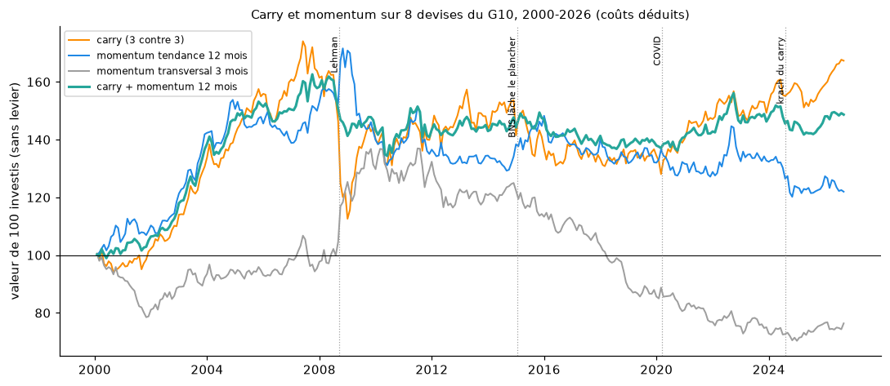
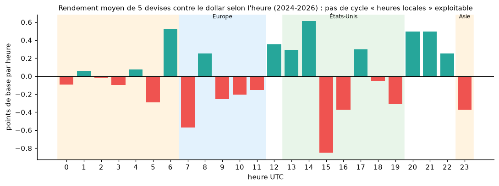

# Au-delà d'Amirou : carry, momentum et saisonnalité intrajournalière

> **Question** : existe-t-il des algorithmes plus prometteurs que les figures de bougies ? On teste ici trois effets que les études académiques décrivent sur le Forex.
> **Scripts** :
> - [`scripts/tester_carry_momentum.py`](../scripts/tester_carry_momentum.py) → [`data/carry_momentum_mensuel.csv`](../data/carry_momentum_mensuel.csv) ;
> - [`scripts/tester_saisonnalite_intraday.py`](../scripts/tester_saisonnalite_intraday.py) → [`data/saisonnalite_intraday_profil.csv`](../data/saisonnalite_intraday_profil.csv) et [`data/saisonnalite_intraday_strategie.csv`](../data/saisonnalite_intraday_strategie.csv).
>
> **Données** :
> - cours quotidiens de la Fed de 1999 à 2026 (H.10, via [datasets/exchange-rates](https://github.com/datasets/exchange-rates)) ;
> - taux directeurs quotidiens de la BIS ;
> - bougies horaires Yahoo Finance (déc. 2023 – sept. 2026).
>
> **Aucun paramètre n'est optimisé** : nombre de devises, durées de 1-3-6-12 mois et fenêtres horaires sont celles de la littérature. Les résultats sont donc des tests honnêtes, pas des meilleurs cas.

## 1. Le carry trade

**Principe** : on achète les devises qui rapportent un taux d'intérêt élevé et on vend celles à taux bas. On gagne le différentiel de taux, tant que le change ne l'efface pas.

**Règle testée** : chaque fin de mois, on trie les 8 devises du G10 (USD, EUR, GBP, JPY, AUD, NZD, CAD, CHF) selon leur taux directeur. On achète les 3 premières, on vend les 3 dernières, à poids égaux. Le rendement inclut la variation du change et le différentiel de taux encaissé ; 0,03 % de frais par rééquilibrage.

| Période | Rendement annuel | Volatilité | Ratio de Sharpe | Pire baisse | Mois positifs |
|---|---|---|---|---|---|
| **2000-2026** | **+2,0 %** | 8,1 % | **0,28** | **−35 %** | 59 % |
| 2000-2009 | +3,4 % | 9,5 % | 0,41 | −35 % (2008) | 62 % |
| 2010-2019 | −0,4 % | 8,1 % | −0,01 | −17 % | 52 % |
| 2020-2026 | +3,3 % | 5,2 % | 0,66 | −6,5 % | 62 % |

- **Le carry rapporte, mais peu, et avec des krachs.** Il gagne en moyenne 2 % par an sans levier. En 2008, il perd 35 % en quelques mois quand tout le monde vend les devises à haut rendement (AUD, NZD) pour racheter le yen.
- **Il dépend des taux** : de 2010 à 2019, avec des taux proches de zéro partout, il n'y a rien à gagner. Il revient depuis 2022 avec la remontée des taux, malgré le « krach du carry » du 5 août 2024.
- Sur 27 ans, le résultat n'est pas statistiquement certain (t = 1,45).

## 2. Le momentum

**Principe** : une devise qui a monté continue de monter (tendance).
- **De tendance** (Moskowitz, Ooi et Pedersen, 2012) : pour chaque devise contre le dollar, on se positionne dans le sens de son rendement des 1, 3, 6 ou 12 derniers mois.
- **Transversal** : on achète les 3 devises qui ont le plus monté sur 3 mois et on vend les 3 qui ont le moins monté.

| Stratégie | 2000-2026 (Sharpe) | 2000-2009 | 2010-2019 | 2020-2026 |
|---|---|---|---|---|
| Tendance 1 mois | 0,00 | 0,59 | −0,57 | −0,18 |
| Tendance 3 mois | 0,10 | 0,58 | −0,30 | −0,19 |
| Tendance 6 mois | 0,06 | 0,52 | −0,04 | −0,58 |
| Tendance 12 mois | 0,15 | 0,49 | −0,07 | −0,17 |
| Transversal 3 mois | −0,11 | 0,36 | −0,59 | −0,27 |

- **Le momentum a marché sur les devises jusqu'en 2008, plus depuis.** C'est ce que la littérature constate aussi : l'effet a été largement exploité par les fonds « CTA » et a disparu des grandes devises.
- Le seul moment fort du momentum est l'automne 2008, quand il profite de la chute du carry.

## 3. La combinaison carry + momentum

Les deux stratégies sont légèrement **opposées** (corrélation −0,11) : le momentum gagne souvent quand le carry s'effondre. On met la moitié du capital dans chacune.

| Période | Rendement annuel | Volatilité | Sharpe | Pire baisse |
|---|---|---|---|---|
| **2000-2026** | +1,5 % | **4,9 %** | **0,33** | **−17 %** |
| 2000-2009 | +3,7 % | 5,2 % | 0,72 | −13 % |
| 2010-2019 | −0,4 % | 5,0 % | −0,05 | −10 % |
| 2020-2026 | +1,1 % | 4,0 % | 0,30 | −9 % |

**La combinaison divise par deux la pire baisse** (−17 % au lieu de −35 %) pour un rendement proche. C'est le principe de la diversification, et c'est la stratégie la plus stable de toutes celles testées dans ce dépôt. Mais elle ne rapporte qu'environ 1,5 % par an sans levier, et rien entre 2010 et 2019.

## 4. La saisonnalité intrajournalière

**Principe** (Breedon et Ranaldo, 2013) : une devise tend à baisser pendant les heures de bureau de son propre pays, par exemple parce que les entreprises locales vendent leur devise pour payer à l'étranger, et à remonter pendant les heures des autres.

**Règle testée** : chaque jour, on vend la devise contre le dollar pendant ses heures locales (Asie 23 h-7 h UTC pour JPY, AUD et NZD ; Europe 7 h-12 h UTC pour EUR, GBP et CHF), puis on l'achète pendant les heures américaines (13 h-20 h UTC). Panier de 6 devises, 2024-2026.

| | Gain par jour | Par an | Statistique t |
|---|---|---|---|
| Vente pendant les heures locales | +0,33 pb | +0,8 % | 0,57 |
| Achat pendant les heures américaines | −0,34 pb | −0,9 % | −0,34 |
| **Total avant frais** | **−0,01 pb** | **0,0 %** | −0,01 |
| **Total après spread** (2 allers-retours par jour) | −2,7 pb | **−6,8 %** | −2,41 |

- **Pas d'effet sur 2024-2026.** L'effet décrit dans l'étude (données 1990-2010) n'apparaît pas, et le spread payé deux fois par jour coûte près de 7 % par an.
- Le profil horaire montre une baisse marquée des devises contre le dollar à 15 h UTC (−0,85 pb, t = −2,1). Mais sur 24 heures testées, une ou deux heures « significatives » sont attendues par hasard.
- Les hausses de 20-22 h UTC tombent au moment du changement de jour (« rollover »), quand le spread est le plus large : elles ne sont pas exploitables.
- **Une piste qui mérite un test plus long : la fin de mois.** Le dernier jour ouvré du mois, pendant la bougie du fixing de Londres (15 h-16 h, heure de Londres), les devises montent en moyenne de **+4,9 pb contre le dollar** (62 % des cas). C'est cohérent avec les rééquilibrages des gérants, mais il n'y a que 34 fins de mois (t = 1,8), et le gain net de spread serait d'environ 3,6 pb par mois. Il faudrait 10-15 ans de données horaires (Dukascopy) pour le confirmer.

## 5. Conclusion

| Stratégie | Résultat sur longue période | Verdict |
|---|---|---|
| Figures de bougies d'Amirou (englobante, bébé abandonné, Bombe, MLQ) | autour de 0 R, souvent négatif après spread | ❌ pas d'avantage mesurable |
| Momentum de tendance | Sharpe 0,15 sur 2000-2026, négatif depuis 2010 | ❌ disparu |
| Saisonnalité intrajournalière | 0 avant frais, −7 %/an après | ❌ |
| Carry | +2 %/an, Sharpe 0,28, krach de −35 % en 2008 | ⚠️ réel mais faible et risqué |
| **Carry + momentum** | **+1,5 %/an, Sharpe 0,33, pire baisse −17 %** | ✅ **le plus robuste testé ici**, mais modeste |
| Fixing de fin de mois | +4,9 pb par fin de mois, 34 observations | 🔎 piste à confirmer |

**Ce qu'il faut retenir** :
- Les stratégies qui tiennent sur le Forex sont des **primes de risque** (carry) et de la **diversification**, pas des figures graphiques.
- Elles rapportent quelques pourcents par an, loin des « 85-90 % de réussite » des masterclass. Même la meilleure reste en dessous de ce qu'un fonds monétaire rapportait en 2023-2026 (plus de 4 %), sauf à utiliser un levier, qui augmente d'autant les krachs.

### Limites
- Taux directeurs au lieu des taux interbancaires à 1 mois (les vrais coûts de portage) : l'écart est faible, sauf en 2008-2009.
- 8 devises seulement ; les études utilisent souvent 20 à 40 devises, émergentes comprises, où le carry est plus fort (et plus risqué).
- La saisonnalité intrajournalière n'est testée que sur 2 ans et 9 mois (limite des données horaires gratuites).
