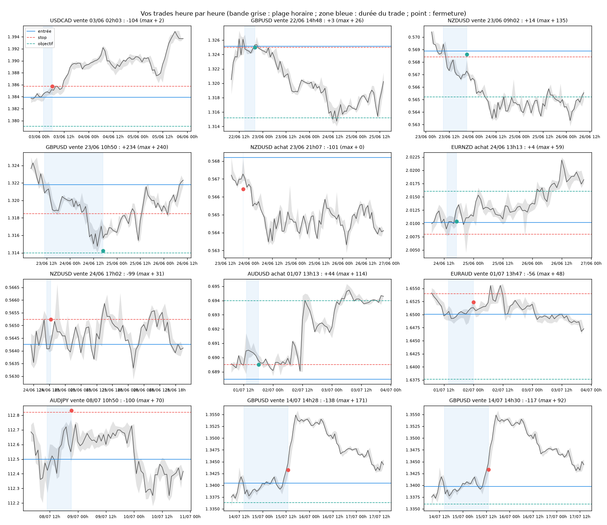

# Compte de prop firm 10 000 $ (juin-juillet 2026) : les trades heure par heure

*Branche `mes-trades-propfirm`, séparée des analyses sur Amirou. Script : `scripts/analyser_compte_propfirm.py` ; données : `data/compte_propfirm/`.*

## Lecture du relevé

- **Heures en UTC** : 18 prix sur 24 tombent dans la bougie horaire de la même heure UTC ; aucun autre décalage ne fait mieux. Si la plateforme affiche l'heure du serveur (souvent UTC+3), le BUY NZDUSD de 21h07 UTC apparaît daté du 24/06 à 00h07, ce qui expliquerait les « dates du 24 ».
- **Résultat des 12 trades** : −415,64 $ (−448,12 $ avec les commissions). Le reste des ~600 $ de perte vient d'autres trades absents du relevé, ou des pertes latentes si la prop firm compte l'equity.
- **Les deux GBPUSD du 14/07 sont notés BUY, mais ce sont des ventes** : leur perte correspond à une hausse du prix (−28,1 pips × 4,90 $/pip = −137,69 $) et leur TP est sous l'entrée.
- **Numéros de trades** : 10272348 (GBPUSD, 23/06) et 10272349 (NZDUSD, 24/06) ont des numéros compris entre ceux du 01/07 et du 08/07, alors que 10164842 à 10164845 couvrent 03/06-23/06. Ils semblent avoir été enregistrés plus tard (corrections ?). À demander à la prop firm.
- **Lien avec Amirou** : AUDUSD 01/07 (#14993, #15006), EURAUD 01/07 (#15004) et les deux GBPUSD 14/07 (#15101, objectif 1.33629 identique ; #15113) copient ses signaux.

## Trade par trade

| Trade | Résultat | Gain latent max (heure) | Perte latente max | Objectif prévu atteint en 72 h ? | Ce qui s'est passé |
|---|---|---|---|---|---|
| USDCAD vente 03/06 02h03 | −104 $ | +2 $ | −108 $ | non | parti tout de suite contre la position ; stop de 18 pips touché à 06h23 |
| GBPUSD vente 22/06 14h48 | +3 $ | +26 $ (16h) | −41 $ | **oui, 24/06 11h (+248 $)**, après un recul de 16 pips | stop remonté au point mort trop tôt |
| NZDUSD vente 23/06 09h02 | +14 $ | **+135 $ (18h)** | −45 $ | **oui, 24/06 07h (+210 $)**, recul max 8 pips | stop de protection 0.5684 touché à **21h06 UTC (rollover)** à 0.56863, 4,5 pips au-dessus du plus haut de l'heure |
| GBPUSD vente 23/06 10h50 | **+234 $** | +240 $ (24/06 14h) | −19 $ | non (1.314 manqué de peu) | bonne sortie ; prix de fermeture 1.31425 hors de la bougie de 16h (14,5 pips plus favorable que le marché) |
| NZDUSD achat 23/06 21h07 | −101 $ | 0 | — | — | ouvert 74 s après la fermeture de la vente, même taille (0,57), sans SL ni TP, fermé 55 s plus tard ; achat 0.56821 / vente 0.56644 autour d'un cours moyen de 0.5673 : **écart de ~18 pips, typique du spread de rollover** |
| EURNZD achat 24/06 13h13 | +4 $ | +59 $ (17h) | −51 $ | oui, 25/06 02h, mais après un recul de 57 pips | la sortie au point mort était la bonne : le stop (−22,6 pips) aurait sauté avant l'objectif |
| NZDUSD vente 24/06 17h02 (1,01 lot) | −99 $ | +31 $ | −33 $ | — | stop à 9,8 pips touché à **18h35** à 0.56524 ; le plus haut de l'heure était 0.56459 (6,5 pips plus bas) ; le marché n'y arrive qu'à 20h |
| AUDUSD achat 01/07 13h13 | +44 $ | **+114 $ (14h)** | jamais négatif | **oui, 02/07 12h (+233 $)**, sans repasser sous l'entrée | stop de protection touché à 18h11 ; Amirou dit « fermez à BE » le 02/07 (#15008) |
| EURAUD vente 01/07 13h47 | −56 $ | +48 $ (21h) | −70 $ | non | fermé à 00h02 ; le stop (1.654) aurait été touché le 02/07 à 07h (−95 $) : fermer a limité la perte |
| AUDJPY vente 08/07 10h50 | −100 $ | +70 $ (11h) | −81 $ | — | stop 112.82 touché à **21h19 UTC (rollover)** à 112.832, 6 pips au-dessus du plus haut de l'heure ; **le marché n'a jamais atteint ce stop dans les 72 h** |
| GBPUSD vente 14/07 14h28 (sans SL) | −138 $ | **+171 $ (17h)** | **−214 $** | non | gain latent rendu, puis forte hausse ; fermé le 15/07 à 13h08 |
| GBPUSD vente 14/07 14h30 (sans SL) | −117 $ | +92 $ (17h) | −168 $ | non | idem ; les deux ensemble : jusqu'à −382 $ latents |

La somme des gains latents maximaux atteints est de +988 $, pour un résultat final de −416 $.

## Les sorties adéquates

1. **Le rollover (21h-21h30 UTC en été, 22h en hiver) vous a coûté environ 200 $ de pertes directes et près de 200 $ de gain manqué** : AUDJPY (−100 $ sur un stop que le marché n'a pas atteint), NZDUSD du 23/06 (+14 $ au lieu de l'objectif à +210 $), puis l'achat NZDUSD de 55 secondes (−101 $). À cette heure, le spread s'élargit de 10 à 20 pips : ne laissez pas de stop serré ouvert à ce moment, élargissez-le ou fermez avant 21h UTC.
2. **Le point mort trop tôt coupe les gagnants** : GBPUSD 22/06, NZDUSD 23/06 et AUDUSD 01/07 atteignaient leur objectif avec un recul de 2 à 16 pips seulement. Plutôt que de remonter le stop au point mort dès quelques pips de gain, sécurisez une partie (par exemple la moitié à +1 R) et laissez courir le reste avec le stop d'origine, ou au point mort seulement après +1 R. Contre-exemple : EURNZD, où la sortie rapide était la bonne. Sur 12 trades, aucune règle n'est démontrée : ce sont des constats, pas une statistique.
3. **Toujours un stop** : les deux GBPUSD du 14/07 sans stop ont atteint −382 $ latents, assez pour toucher une limite de perte journalière si la prop firm compte l'equity. Le stop d'Amirou (1.34364 / 1.34390) aurait donné une perte du même ordre (environ −284 $), mais connue à l'avance.
4. **Prendre une partie du gain sur les trades d'Amirou** : à 17h le 14/07, les deux ventes GBPUSD étaient à +263 $ ensemble ; le signal (#15118 « va toucher TP sous peu ») ne s'est pas réalisé.
5. **Taille des positions** : 1,01 lot avec un stop de 9,8 pips (NZDUSD 24/06) et 0,79 lot avec 18 pips (USDCAD) : environ 1 % du compte chacun, correct ; mais deux positions simultanées sur la même paire sans stop (14/07) doublent le risque.

## À demander à la prop firm

- Le **journal des ordres** (origine : client, mobile, EA ou gestionnaire ; adresse IP) de l'achat NZDUSD 10164845 du 23/06 à 21:07:46, que vous dites ne pas avoir passé.
- L'**historique des cotations (ticks, bid et ask) et du spread** : NZDUSD 23/06 vers 21:06, AUDJPY 08/07 vers 21:19, NZDUSD 24/06 vers 18:35 (stop touché alors que le marché était 6,5 pips plus bas d'après les cours publics).
- Pourquoi les trades 10272348 et 10272349 ont des numéros postérieurs au 01/07, et pourquoi la fermeture de 10272348 (1.31425) est hors du marché de 16h.
- Pourquoi les deux GBPUSD du 14/07 sont notés BUY.

**Limite** : les cours utilisés (Yahoo) sont des cours publics moyens, sans le spread de votre courtier, à l'heure près. Un écart de 1 à 3 pips est normal ; 4 à 15 pips, surtout au rollover, mérite une réclamation avec les données de la prop firm.

## Quelle stratégie ces trades suivent-ils ?

Déduit des trades eux-mêmes (tendance sur 5 jours, plus haut et plus bas de la veille, niveaux MLQ, heures, stops et objectifs) :

| Trade | Lecture |
|---|---|
| GBPUSD vente 22/06 | dans la baisse des 5 jours (−165 pips) ; vente après un dépassement du plus haut de la veille, **exactement sur le MLQ 1.3250** |
| NZDUSD vente 23/06, GBPUSD vente 23/06, NZDUSD vente 24/06, EURNZD achat 24/06 | **continuation de tendance** (130 à 210 pips sur 5 jours dans le sens du trade), entrée à Londres ou New York après la cassure du plus bas ou du plus haut de la veille |
| AUDUSD achat 01/07 | signal d'Amirou (#14993, #15006), après une **englobante haussière** la veille |
| EURAUD vente 01/07 | signal d'Amirou (#15004), **sur le MLQ 1.6500** |
| AUDJPY vente 08/07 | **sur le MLQ 112.50** au pip près ; pas de signal d'Amirou ce jour-là (#15033 concerne EURAUD) |
| GBPUSD ventes 14/07 | signal d'Amirou (#15113 « vendez tout de suite », 3 minutes avant) ; contre la hausse des 5 jours, après un dépassement du plus haut de la veille |
| USDCAD vente 03/06 | entrée à 02h UTC (Asie), sans contexte particulier |

- **Méthode d'Amirou appliquée** : 3 entrées sur 12 à moins d'un pip d'un MLQ (multiple de 250 pips), ce qui n'arrive pas par hasard ; objectifs à 2,5-3 R ; stops de 10 à 40 pips ; 11 trades sur 12 un lundi, mardi ou mercredi, la plupart à l'ouverture de Londres (09h-11h UTC) ou de New York (13h-14h UTC).
- **Deux familles** : en juin, une continuation de tendance personnelle (cassure du plus haut ou du plus bas de la veille dans le sens des 5 derniers jours), plutôt réussie au départ (gains latents de +26 à +240 $) ; en juillet, surtout des copies de signaux d'Amirou et des entrées sur MLQ, à contre-tendance pour les GBPUSD du 14/07.
- **Ce que disent les tests du projet** : le MLQ seul n'a aucun avantage mesurable (15,6 % d'objectifs, −0,08 R) ; l'englobante + MLQ est la seule piste positive, encore à confirmer ; les trades d'Amirou copiés à la publication font +0,21 R par trade, sans certitude.

## Mes raisons : ce que dit la discussion d'analyse (22/06 - 09/07/2026)

*Source : [`data/compte_propfirm/discussion_analyse_signalx_2026-06-22_au_07-09.md`](../data/compte_propfirm/discussion_analyse_signalx_2026-06-22_au_07-09.md), journal de recherche tenu avec une IA, qui croise les rapports SignalX, les billets de Marc Chandler (Marc to Market), le COT de la CFTC et le sentiment des particuliers (Myfxbook, FXSSI). L'en-tête de l'export indique « Auteur : Hamma dit Amirou Touré », parce que les rapports SignalX analysés sont les siens. Les citations sont reprises telles quelles.*

**La méthode d'analyse** :
1. **force et faiblesse des devises** d'après les banques centrales et l'actualité (rapport SignalX du 22/06 : USD et CHF forts ; JPY, AUD, NZD, CAD faibles ; EUR et GBP « sous pression ») ;
2. **COT** : suivre les positions des spéculateurs et surtout leurs variations (« NZD : −45 161 (−13 590 — −43 %) — accélération massive ») ;
3. **sentiment des particuliers à contre-courant** : vendre ce que 80-94 % des particuliers achètent (« NZDUSD : 94 % LONG retail → contrarien extrême ») ;
4. **Chandler** pour les niveaux et le contexte (plus bas annuels, options, différentiels de taux) ;
5. un **classement par étoiles** des idées, révisé à chaque nouvelle donnée ;
6. pour l'entrée : les **niveaux** (MLQ, plus bas annuels, rebond vers une résistance), et les signaux d'Amirou en juillet.

**Trade par trade** :

| Trade | Raison documentée dans la discussion | Ce qui s'est passé |
|---|---|---|
| USDCAD vente 03/06 | **aucune** (avant le début du journal) ; le journal classe ensuite USDCAD à l'**achat** ⭐⭐⭐⭐⭐ (CAD « le plus shorté du G10 », 88-94 % des particuliers vendeurs) | la vente allait contre l'analyse faite ensuite ; stop touché en 4 h |
| GBPUSD vente 22/06 | GBP « sous pression » (« prime de risque politique Burnham/Starmer ») ; COT GBP −64 213 puis −71 585 ; entrée sur le MLQ 1.3250 | gain latent de +26 $ seulement, sortie au point mort ; l'objectif est atteint le 24/06 |
| NZDUSD vente 23/06 | NZD faible ; classée ⭐⭐ (« trade surchargé ») le 22/06, puis ⭐⭐⭐⭐⭐ après le COT du 16/06 (« signal COT accélère ») ; 89-94 % des particuliers acheteurs | +135 $ latents, stop de protection touché au rollover (+14 $) ; l'objectif est atteint le lendemain |
| GBPUSD vente 23/06 | « Starmer démissionne — Burnham successeur probable » ; short GBP qui s'aggrave au COT ; 65 % des particuliers acheteurs (« biais sell ») | **+234 $**, le meilleur trade, en accord avec l'analyse |
| NZDUSD achat 23/06 21h07 | **aucune** : contraire à toute l'analyse (NZD à vendre) ; vous dites ne pas l'avoir passé | −101 $ en 55 s au rollover |
| EURNZD achat 24/06 | COT EUR acheteur (+34 353, « institutions achètent EUR fortement ») contre NZD vendu (−45 161) : devise forte contre devise faible | +59 $ latents, sortie à +4 $ ; la sortie rapide était la bonne |
| NZDUSD vente 24/06 (1,01 lot) | même raison qu'au 23/06, renforcée : « 94 % LONG retail », Chandler (AUD au plus bas depuis avril, Fed : probabilité de hausse remontée à 68 %) | stop de 9,8 pips touché à 18h35, avant que le marché n'y arrive ; position la plus lourde (10 $/pip) avec le stop le plus court |
| AUDUSD achat 01/07 | signal d'Amirou (#14993) ; **contraire à la discussion**, qui voit l'AUD baissier (« AUD casse la 200MA à 0,6865 → H&S activé, cible 0,6680 », COT AUD retourné à la vente) ; seuls arguments pour : cible Bloomberg 0,6964 et saisonnalité (« fond fin mai → hausse jusqu'en fin juillet ») | +114 $ latents, sortie à +44 $ ; l'objectif est atteint le lendemain |
| EURAUD vente 01/07 | signal d'Amirou (#15004), sur le MLQ 1.6500 ; cohérent avec « CPI eurozone juin : 2,8 % — surprise baissière majeure → BCE ne peut plus monter » | +48 $ latents, puis −56 $ ; l'objectif n'est pas atteint |
| AUDJPY vente 08/07 | pas de signal d'Amirou ; contexte du 08/07 : « Renewed War Roils Markets » (fin du cessez-le-feu, actions en baisse) défavorable à l'AUD ; vente sur le MLQ 112.50 | +70 $ latents, puis stop touché au rollover, à un prix que le marché n'a pas atteint |
| GBPUSD ventes 14/07 | signal d'Amirou (#15101, #15113) ; **contraire à votre propre synthèse du 09/07** : « GBP la devise la plus shortée du retail […] Signal contrarien massif », GBPUSD 77 % vendeurs → « BUY GBP », saisonnalité et Bailey en « Convergence ✅ », et dès le 29/06 « GBPUSD → Envisager BUY au-dessus de 1,3280 » | −255 $ ; GBPUSD monte ensuite à 1,355 : **votre analyse avait raison** contre le signal suivi |

**Ce que valaient les idées de la discussion** (mouvement des cours, à partir de la date de l'idée) :

| Idée | Période | Résultat |
|---|---|---|
| USDJPY achat ⭐⭐⭐⭐⭐ | 22/06 → 09/07 | +67 pips |
| USDCAD achat ⭐⭐⭐⭐⭐ | 23/06 → 09/07 | −11 pips |
| NZDUSD vente ⭐⭐⭐⭐⭐ (« sortir avant 8 juillet ») | 23/06 → 07/07 | −7 pips (après une baisse d'environ 100 pips le 24/06) |
| EURGBP achat (abandonné le 29/06) | 22/06 → 29/06 | −21 pips |
| NZDCAD vente ⭐⭐⭐⭐ | 23/06 → 09/07 | −92 pips |
| EURUSD vente sous 1,1385 (29/06) | 29/06 → 14/07 | −42 pips |
| **GBPUSD achat au-dessus de 1,3280 (29/06)** | 29/06 → 14/07 | **+173 pips** |
| GBPUSD achat (synthèse du 09/07) | 09/07 → 16/07 | +114 pips |
| USDJPY achat (09/07) | 09/07 → 23/07 | +123 pips |

- **L'analyse de fond tient la route sur la livre et le yen** : les trois meilleures idées (GBPUSD achat, USDJPY achat) sont celles où COT, sentiment et banques centrales allaient dans le même sens.
- **Elle n'a pas été suivie quand elle comptait** : les plus grosses pertes (GBPUSD du 14/07, −255 $) viennent de signaux d'Amirou pris contre votre propre conclusion, et l'achat AUDUSD du 01/07 allait aussi contre elle.
- **Les trades qui suivaient votre analyse étaient bien orientés** (GBPUSD et NZDUSD des 22-24/06 : gains latents de +26 à +240 $) ; ils ont été perdus ou réduits par la gestion : point mort trop tôt, rollover, stop de 9,8 pips sur la position la plus lourde.
- **Prix à vérifier dans la discussion** : le 25/06, « GBP/USD 1,3250 (rebond depuis 1,3160) » alors que GBPUSD cotait 1,3152-1,3219 ce jour-là ; dans la synthèse du 09/07, GBPUSD est à 1,3253 alors qu'il cotait 1,338-1,343 (le tableau Myfxbook du même jour donne 1,33534, plus juste). Les autres prix cités correspondent aux cours.

**Règles à tirer de vos propres raisons** :
1. Ne prendre un signal d'Amirou que s'il va dans le sens de votre analyse COT, sentiment et banques centrales ; sinon, s'abstenir.
2. Sur les trades alignés avec l'analyse, laisser de la place : point mort à +1 R seulement, stop d'au moins 0,5 ATR, rien de serré ouvert au rollover de 21h UTC.
3. Taille constante : pas de 1,01 lot avec 10 pips de stop sur une idée déjà en place depuis la veille.
