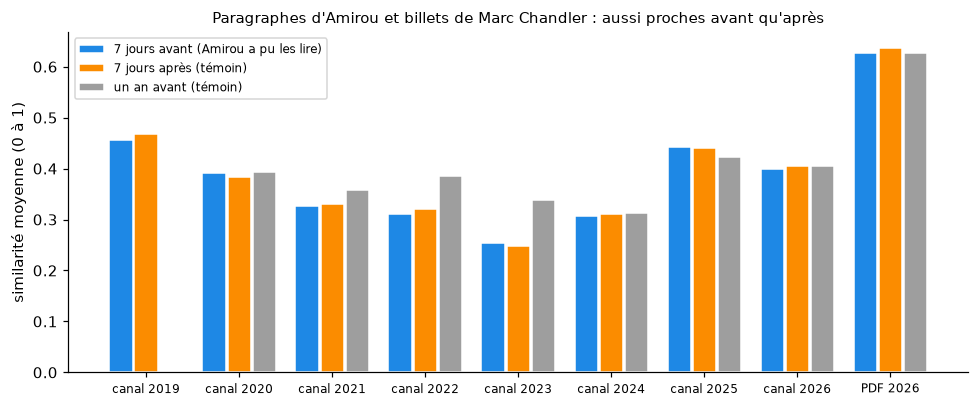
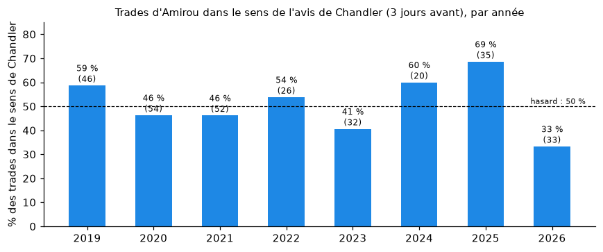

# Amirou et Marc to Market (Marc Chandler) : confrontation

*Rédigé le 06/10/2026, à la demande de l'utilisateur, qui indique qu'Amirou s'appuie sur les analyses de Marc to Market. Aucun message du canal ni aucun PDF ne cite cette source.*

## Données

- **Marc Chandler** : 2 489 billets publics du blog [marctomarket.com](https://www.marctomarket.com), de mars 2019 au 6 octobre 2026.
  - Commentaire de marché presque quotidien, plus un « Week Ahead » le week-end.
  - Fichier : `data/marc_to_market/billets.jsonl.gz` (`scripts/collecter_marc_to_market.py`).
  - **Non couverts** : ses textes payants et ses interventions hors du blog (réseaux sociaux, presse).
- **Amirou** :
  - les 22 rapports PDF de 2026 (dont « SignalX »), datés par leur message de publication ;
  - ses messages de plus de 300 caractères dans le canal (1 389 paragraphes, 2019-2026) ;
  - ses trades : registre texte (281), captures rejouées (248 + 83 copiables) ;
  - son biais écrit par devise (`data/fondamental/biais_amirou.csv`).

**Deux questions** :
1. Ses textes reprennent-ils ceux de Chandler ?
2. Ses positions vont-elles dans le sens de Chandler, et est-ce que cela l'aide ?

## 1. Les textes : pas de reprise mesurable

- **Méthode** :
  - Amirou écrit en français, Chandler en anglais. On compare donc le **sens** des paragraphes avec un modèle multilingue (sentence-transformers, `paraphrase-multilingual-MiniLM-L12-v2`).
  - La similarité va de 0 à 1 : environ 0,8 et plus pour une traduction, 0,5-0,7 pour deux textes sur la même actualité.
  - Pour chaque paragraphe d'Amirou, on cherche le paragraphe le plus proche chez Chandler à trois moments :
    - dans les **7 jours avant** sa publication ;
    - dans les **7 jours après** (même actualité, mais Amirou ne pouvait pas les avoir lus) ;
    - **un an plus tôt** (autre actualité).
  - Si Amirou reprenait Chandler, « avant » dépasserait nettement « après ».



| Textes d'Amirou | Paragraphes | Similarité moyenne : 7 jours avant | 7 jours après | un an avant | Paragraphes ≥ 0,8 avant / après |
|---|---|---|---|---|---|
| Rapports PDF 2026 | 431 | 0,626 | 0,636 | 0,628 | 11 / 11 |
| Canal 2019 | 48 | 0,455 | 0,468 | — | 0 / 0 |
| Canal 2020 | 78 | 0,391 | 0,383 | 0,394 | 0 / 0 |
| Canal 2021 | 51 | 0,326 | 0,331 | 0,358 | 0 / 0 |
| Canal 2022 | 129 | 0,310 | 0,321 | 0,384 | 0 / 0 |
| Canal 2023 | 291 | 0,254 | 0,248 | 0,338 | 0 / 0 |
| Canal 2024 | 230 | 0,307 | 0,311 | 0,312 | 1 / 0 |
| Canal 2025 | 318 | 0,442 | 0,441 | 0,423 | 0 / 1 |
| Canal 2026 | 244 | 0,400 | 0,404 | 0,405 | 1 / 0 |

- **« Avant » ne dépasse jamais « après »**, ni le témoin d'un an plus tôt.
- **Les rapports PDF ressemblent davantage à Chandler que les messages du canal**, mais autant à ses billets d'il y a un an. C'est le même registre (commentaire macroéconomique de marché), pas le même texte.
- **Les paragraphes les plus proches (0,83 à 0,89) ne sont pas des traductions.** Ce sont deux comptes rendus de la même actualité, par exemple :
  - le dollar canadien au plus bas de l'année, avec l'écart de taux à deux ans entre le Canada et les États-Unis : PDF du 30/06/2026 (#14973), billet de Chandler du 27/06 ;
  - le yen au plus bas depuis 40 ans au-dessus de 162 : PDF #15019, billet du 30/06 ;
  - le Groenland et les droits de douane : PDF #14347, billet du 19/01.
  - Les chiffres d'Amirou ne sont pas ceux de Chandler (niveaux, dates, détails).
- **Le cas de la « Chandler Signature »** (PDF du 10/02/2026, #14409) :
  - le rapport reprend les trois sujets du billet de Chandler de la veille (« Dramatic Victory for Takaichi, Beijing Cautions on US Treasuries, and Starmer's Woes Persist », 09/02) ;
  - il écrit : « Le rapport de ce matin souligne… » ;
  - mais ses chiffres (682,6 milliards de dollars de Treasuries chinois, plus bas depuis 2008 ; Sentix à 4,2 ; Nikkei +3,89 %) **ne figurent pas chez Chandler**. Ils viennent des dépêches du jour.
  - Il s'agit donc au mieux d'une inspiration pour le choix des sujets, mêlée à d'autres sources. L'expression « Chandler Signature » pourrait trahir une consigne donnée à un outil de rédaction (« à la manière de Chandler »), mais ce n'est qu'une hypothèse.
- **La structure des rapports n'est pas celle de Chandler.**
  - Les rapports suivent l'ordre classique des huit grandes devises : USD, EUR, JPY, GBP, CHF, AUD, NZD, CAD.
  - Chandler suit l'ordre USD, EURO, CNY, JPY, GBP, CAD, AUD, MXN, et commente toujours le yuan et le peso mexicain, absents chez Amirou.
  - Seul l'intitulé « Overview » est commun.

## 2. Les positions : Amirou ne suit pas le sens de Chandler

**Biais de Chandler** : pour chaque jour et chaque devise, on a tiré du texte un avis de hausse ou de baisse.
- **Lexique** : sujet de la phrase (dollar, euro, yen…) et mots de hausse ou de baisse.
- **Deux types de phrases** :
  - « vers l'avant » : *expect, look for, likely, risk, could…* ;
  - « constat » : description de ce qui s'est passé.
- **Fichier** : `data/marc_to_market/biais_chandler.csv` (`scripts/biais_marc.py`).

**Contrôle de la méthode** : le constat de Chandler suit le mouvement de la veille dans 59 à 65 % des cas selon la paire (EURUSD 64 %, AUDUSD 64 %, USDCAD 59 %). L'extraction capte donc bien son avis, avec du bruit.

**Ce que vaut son avis « vers l'avant »** (10 paires, 2019-2026) :

| Horizon | Jours avec un avis | Mouvement dans le sens de Chandler |
|---|---|---|
| Lendemain | 5 894 | **51,2 %** |
| 5 jours | 5 872 | 52,0 % |

C'est à peine mieux qu'une pièce. Chandler commente le marché, il ne donne pas de signaux.

**Les trades d'Amirou face à l'avis de Chandler des 3 jours précédents** :

| Trades d'Amirou | Avec un avis de Chandler | Dans le même sens | R moyen : même sens | R moyen : sens opposé |
|---|---|---|---|---|
| Registre texte 2019-2026 | 141 | **51,8 %** | — | — |
| Captures OCR copiables | 120 | **50,0 %** | +1,08 (60) | +1,95 (60) |
| Revue visuelle copiables | 37 | **45,9 %** | −0,24 (17) | +0,14 (20) |



| Année | 2019 | 2020 | 2021 | 2022 | 2023 | 2024 | 2025 | 2026 |
|---|---|---|---|---|---|---|---|---|
| Trades avec un avis | 46 | 54 | 52 | 26 | 32 | 20 | 35 | 33 |
| Même sens que Chandler | 59 % | 46 % | 46 % | 54 % | 41 % | 60 % | 69 % | 33 % |

- **Globalement, Amirou va dans le sens de Chandler une fois sur deux**, comme au hasard.
  - Seule 2025 (69 % sur 35 trades) penche vers Chandler ;
  - 2026 penche à l'opposé (33 %).
- **Ses trades qui vont dans le sens de Chandler ne gagnent pas plus.** C'est même plutôt l'inverse, mais les écarts restent dans le bruit :
  - captures : +1,08 R contre +1,95 R ;
  - dans le registre, 36 % des TP vont dans le sens de Chandler, contre 58 % des stops.
- **Son biais écrit par devise** (202 cas où les deux ont un avis) rejoint celui de Chandler dans **51,5 %** des cas.

## 3. Ce qu'il faut retenir

1. **Aucune reprise mesurable de Chandler** dans les textes d'Amirou, ni dans le canal (2019-2026) ni dans les rapports PDF de 2026.
   - Les rapports traitent souvent des mêmes sujets que Chandler le même jour, mais avec d'autres chiffres et une autre structure.
   - Chandler a pu être une lecture parmi d'autres, par exemple pour le 10/02/2026.
2. **Les positions d'Amirou ne suivent pas l'avis de Chandler** : même sens dans 50 % des cas. Et quand elles le suivent, elles ne gagnent pas plus.
3. **Copier Chandler ne donnerait pas d'avantage** : son avis « vers l'avant » annonce le sens du lendemain dans 51 % des cas. C'est un commentateur reconnu, pas un fournisseur de signaux.
4. **Limites** :
   - seuls les billets publics du blog ont été analysés ;
   - l'avis de Chandler est extrait par lexique, une méthode approximative ;
   - le rapprochement multilingue mesure la proximité de sens, pas la copie mot à mot.
   - Si Amirou lit les textes payants de Chandler ou ses interventions ailleurs, ce test ne peut pas le voir.

## Relancer

```
python scripts/collecter_marc_to_market.py      # billets depuis 2019
pip install sentence-transformers               # torch CPU
python scripts/confronter_textes_marc.py        # similarité des textes (~15 min sur CPU)
python scripts/biais_marc.py                    # biais de Chandler et confrontation des trades
```
