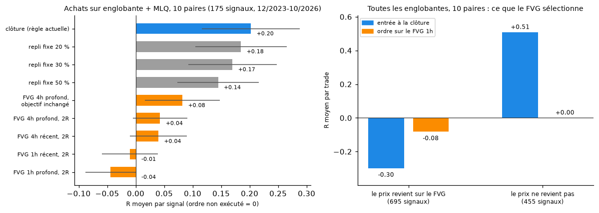

# Englobante : entrer sur un FVG 1h ou 4h plutôt qu'à la clôture ?

*Rédigé le 06/10/2026, à la demande de l'utilisateur. Script : [`scripts/tester_englobante_fvg.py`](../scripts/tester_englobante_fvg.py) ; résultats : [`data/englobante_fvg/`](../data/englobante_fvg/).*

## La question

La seule piste positive des tests de la masterclass est l'**achat sur englobante journalière qui rejette un MLQ** ([`MASTERCLASS_TRADES_DATES.md`](MASTERCLASS_TRADES_DATES.md), suivie en démo dans [`SUIVI_DEMO.md`](SUIVI_DEMO.md)). L'entrée se fait à la clôture de la bougie englobante, avec le stop sous son plus bas.

L'idée testée : attendre un repli sur un **FVG** (fair value gap, ou déséquilibre) laissé en 1h ou en 4h pendant la bougie englobante. L'entrée est alors plus basse, le stop plus court, et le ratio meilleur.

## Méthode

- **Données** : cours horaires Yahoo du 15/12/2023 au 05/10/2026 (les cours horaires Dukascopy plus anciens sont bloqués depuis le cloud). Bougies journalières 00h-24h UTC reconstruites depuis l'horaire.
- **Signal** : même règle que le suivi en démo (bougie J qui englobe le corps de J-1 de couleur opposée ; stop à 2 pips au-delà de l'extrême de J ; sortie au stop, à l'objectif, sinon à la clôture de J+3). Testé :
  - sur la règle suivie en démo (achats, plus bas de J à 25 pips d'un MLQ, 10 paires : **175 signaux**) ;
  - sur 12 autres paires, et sur toutes les englobantes (achats et ventes, avec ou sans MLQ : 1 779 signaux sur les 10 paires, 2 183 sur les autres), pour voir si un effet se répète.
- **FVG** : sur les bougies 1h (ou 4h) de la journée J, trois bougies dont la 1re et la 3e ne se chevauchent pas (achat : plus haut de la 1re < plus bas de la 3e), **pas encore comblé** à la clôture de J.
  - FVG « récent » (le plus proche du prix) ou « profond » (le plus proche du stop) ;
  - ordre limite au **haut** du FVG ou en son **milieu** ;
  - ordre valable 24 h (ou 48 h) ; le stop ne change pas ;
  - objectif **2 R depuis la nouvelle entrée**, ou **objectif inchangé** (même prix qu'avec l'entrée à la clôture, donc un ratio plus grand).
- **Témoin** : ordre limite à un repli fixe (20, 30, 40 ou 50 % de la distance clôture-stop) sur tous les signaux. Si le FVG n'apporte rien de plus qu'« acheter plus bas », le témoin fait aussi bien.
- **Rejeu** heure par heure ; si le stop et l'objectif tombent dans la même heure, le stop compte ; spread déduit.
- **Mesure** : R moyen **par signal**, un ordre non exécuté comptant 0. C'est ce que rapporte vraiment la règle. Le R par trade exécuté seul flatte les variantes qui s'exécutent rarement.

## Résultats



**Règle suivie en démo (achats + MLQ, 10 paires, 175 signaux)** :

| Entrée | Ordres exécutés | Objectifs atteints (exécutés) | R par trade exécuté | **R par signal** (± erreur type) |
|---|---|---|---|---|
| **Clôture de l'englobante (règle actuelle)** | 100 % | 18 % | +0,20 | **+0,20** (±0,09) |
| Repli fixe 20 %, 2 R | 77 % | 23 % | +0,24 | +0,18 (±0,08) |
| Repli fixe 30 %, 2 R | 63 % | 26 % | +0,27 | +0,17 (±0,08) |
| Repli fixe 50 %, 2 R | 42 % | 41 % | +0,35 | +0,14 (±0,07) |
| FVG 4h profond, haut, objectif inchangé | 25 % | 9 % | +0,33 | +0,08 (±0,07) |
| FVG 4h profond, haut, 2 R | 25 % | 26 % | +0,17 | +0,04 (±0,05) |
| FVG 4h récent, haut, 2 R | 31 % | 20 % | +0,13 | +0,04 (±0,05) |
| FVG 1h récent, haut, 2 R | 35 % | 15 % | −0,03 | −0,01 (±0,05) |
| FVG 1h profond, haut, 2 R | 23 % | 20 % | −0,19 | −0,04 (±0,05) |

Les 33 variantes sont dans `data/englobante_fvg/resultats.csv`. Meilleure variante FVG de chaque groupe, contre l'entrée à la clôture (R par signal) :

| Groupe | Signaux | Clôture | Meilleur FVG |
|---|---|---|---|
| Achats + MLQ, 10 paires (règle en démo) | 175 | **+0,20** | +0,08 |
| Achats + MLQ, 12 autres paires | 209 | +0,10 | +0,11 |
| Toutes englobantes, 10 paires | 1 779 | +0,01 | +0,01 |
| Toutes englobantes, 12 autres paires | 2 183 | −0,07 | +0,02 |

- **Le FVG ne bat jamais nettement l'entrée à la clôture.** Il fait au mieux jeu égal, avec une variante différente à chaque fois, signe de hasard.
- Il ne « gagne » que là où l'englobante perd déjà (−0,07 R) : il évite alors des trades perdants, mais pour un résultat proche de zéro.

## Pourquoi : le FVG sélectionne les mauvais trades

Sur toutes les englobantes des 10 paires, avec un ordre au haut du FVG 1h le plus récent :

| | Signaux | Entrée à la clôture | Entrée sur le FVG |
|---|---|---|---|
| Le prix revient sur le FVG (ordre exécuté) | 695 | **−0,30 R** | −0,08 R |
| Le prix ne revient pas (ordre non exécuté) | 455 | **+0,51 R** | 0 (trade raté) |
| Pas de FVG non comblé | 629 | — | 0 |

- **Quand le prix revient chercher le FVG, c'est souvent que l'englobante échoue.** L'entrée plus basse améliore ces trades (−0,30 → −0,08 R), mais ils restent perdants.
- **Les meilleurs trades ne reviennent pas** : le prix part directement dans le sens de l'englobante, et l'ordre limite n'est jamais exécuté. On rate justement ceux qui paient.
- **Plus de la moitié des englobantes n'a aucun FVG 4h non comblé** (92 sur 175 pour la règle en démo).
- Même constat avec la règle en démo : entrée à la clôture −0,12 R quand le FVG 4h profond est touché, +0,38 R quand il ne l'est pas.

C'est le piège classique des entrées sur repli : le ratio affiché s'améliore (stop plus court, objectif plus loin), mais l'ordre ne s'exécute que dans les cas défavorables.

## Autres entrées : repli tenté la nuit, ordre stop, confirmation

*Ajouté le 06/10/2026. Script : [`scripts/tester_entrees_englobante.py`](../scripts/tester_entrees_englobante.py) ; résultats : `data/englobante_fvg/entrees_resultats.csv`.*

Le défaut du FVG étant de rater les trades qui partent directement, six autres entrées ont été testées. La liste a été fixée avant de lancer le test, avec le même stop, un objectif à 2 R depuis l'entrée réelle et la même sortie à J+3 :

- **Londres 07h** : au marché à 07h UTC le lendemain ;
- **ordre stop au-delà de J** : achat 1 pip au-dessus du plus haut de l'englobante (vente : sous le plus bas), valable 24 h ou 48 h ;
- **confirmation 1h** : à la clôture de la première bougie 1h qui clôture au-delà de l'extrême de J ;
- **repli la nuit, sinon Londres** : ordre limite à 30 % de la distance clôture-stop (ou au haut du FVG 4h le plus récent) entre 00h et 07h UTC ; s'il n'est pas exécuté, entrée au marché à 07h. Aucun signal n'est raté.

Écart avec l'entrée à la clôture, **calculé signal par signal** (R par signal, ± erreur type de l'écart) :

| Entrée | Achats + MLQ, 10 paires (175) | Achats + MLQ, autres paires (209) | Toutes, 10 paires (1 779) | Toutes, autres paires (2 183) |
|---|---|---|---|---|
| Clôture (référence, R par signal) | +0,20 | +0,10 | +0,01 | −0,07 |
| Londres 07h | −0,05 (±0,05) | −0,13 (±0,05) | −0,06 (±0,02) | −0,02 (±0,01) |
| Ordre stop au-delà de J, 24 h | −0,06 (±0,05) | −0,02 (±0,05) | −0,00 (±0,02) | +0,02 (±0,02) |
| Ordre stop au-delà de J, 48 h | −0,06 (±0,05) | −0,02 (±0,05) | −0,01 (±0,02) | +0,01 (±0,02) |
| Confirmation 1h | −0,10 (±0,05) | −0,03 (±0,06) | −0,01 (±0,02) | +0,04 (±0,02) |
| Repli 30 % la nuit, sinon Londres | +0,01 (±0,06) | +0,01 (±0,05) | −0,02 (±0,02) | +0,02 (±0,01) |
| FVG 4h la nuit, sinon Londres | −0,04 (±0,05) | −0,11 (±0,04) | −0,05 (±0,02) | −0,02 (±0,01) |

- **Aucune entrée ne bat nettement la clôture.** Le meilleur écart (« repli 30 % la nuit, sinon Londres » : +0,01 R) est 6 fois plus petit que son erreur type.
- **Attendre Londres coûte** : de 0,02 à 0,13 R. Après une englobante, le prix tend à poursuivre dans son sens pendant la nuit, et l'entrée à la clôture en profite.
- **La confirmation (ordre stop, clôture 1h au-delà de J)** n'aide que là où l'englobante perd déjà (autres paires, toutes englobantes : +0,02 à +0,04 R, pour un résultat qui reste négatif). Sur la règle suivie en démo, elle coûte de 0,06 à 0,10 R.
- **Conclusion** : l'entrée à la clôture est déjà la meilleure des entrées testées. S'il y a un avantage, il vient du choix du signal (englobante qui rejette un MLQ), pas du point d'entrée.

## Ce qu'il faut retenir

1. **Ni les FVG 1h ou 4h, ni les replis, ni les entrées sur confirmation n'améliorent l'entrée sur l'englobante**, sur près de trois ans de cours horaires et 22 paires. Ils la dégradent : de +0,20 R à +0,08 R par signal au mieux, et à moins de zéro en 1h.
2. **Un repli fixe, sans FVG, fait mieux que le FVG**, et lui-même fait moins bien que l'entrée à la clôture. Le FVG n'apporte aucune information sur l'endroit où le prix va se retourner.
3. **Le R par trade est trompeur** : certaines variantes FVG affichent un R par trade plus élevé (+0,33 R), mais sur un quart des signaux seulement.
4. **La règle suivie en démo ne change pas** (CLAUDE.md : ne pas changer la règle en cours de suivi). Sur cette période, elle fait +0,20 R par signal, mais l'erreur type est de ±0,09 R : le suivi hors échantillon reste nécessaire.
5. **Limites** : 2,8 ans de données horaires seulement ; FVG définis de façon mécanique (une lecture discrétionnaire peut retenir d'autres zones, mais elle n'est pas testable telle quelle) ; 33 variantes testées, donc la meilleure de chaque groupe est un peu flattée par le hasard, ce qui renforce la conclusion négative.

## Relancer

```
python scripts/prix_yahoo.py --mettre-a-jour      # compléter les cours horaires
python scripts/tester_englobante_fvg.py
python scripts/tester_entrees_englobante.py
python scripts/figures_rapports.py
```
