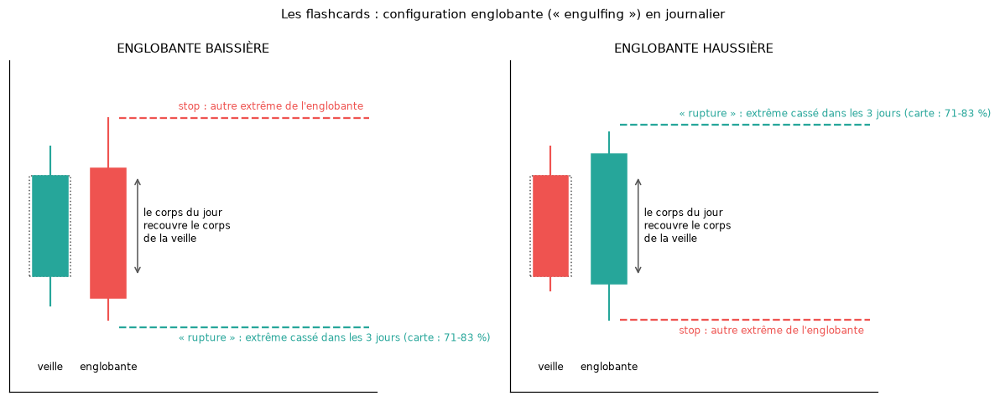
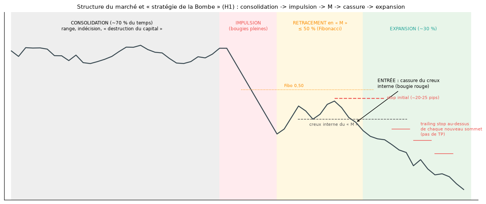

# Guide illustré des stratégies d'Amirou

> Ce guide décrit chaque stratégie **telle qu'Amirou l'enseigne**, dans le canal et dans les masterclass (résumés fournis par l'utilisateur), avec un schéma. Les résultats des tests sur les cours réels sont rappelés en une ligne, avec un lien vers le rapport détaillé.
> Schémas : [`scripts/figures_rapports.py`](../scripts/figures_rapports.py) → `assets/figures/guide_*.png`.

## 1. La stratégie lundi-mardi-mercredi (« trois barres »)

**L'idée** : la direction du mercredi se lit dans les bougies journalières du lundi et du mardi. Le lundi « établit le range », le mardi piège les acheteurs, le mercredi « réalise le profit ».

**Vente (mercredi baissier)** :
1. **Lundi** : bougie très haussière, « pleine » (peu de mèches), qui clôture près de son plus haut.
2. **Mardi** : le prix dépasse le plus haut du lundi, de préférence pendant la session de Londres (8 h – fin de Londres), puis le rejette. Le mardi clôture en bougie rouge, sous la clôture du lundi. Si New York ne parvient pas à dépasser ce sommet, le scénario baissier est confirmé.
3. **Mercredi** : mouvement baissier impulsif.

**Ordre** :
- entrée à la clôture du mardi (22-23 h) ou, en « sniper », au retour sur le plus haut du lundi (sur un MLQ s'il y en a un) ;
- stop au-dessus du plus haut du mardi ;
- objectif au plus bas du lundi, avec au moins 60 pips de marge et un ratio d'au moins 1:1,2 ;
- sortie au plus tard le vendredi.

**Achat** : c'est le miroir. Lundi fortement baissier, mardi qui prend le plus bas du lundi puis clôture vert, objectif au plus haut du lundi.

**Ce qu'il en dit** :
- « 85 % sur GBPUSD, 70-75 % sur AUDJPY », sur dix ans de statistiques ;
- environ 4 setups par mois ;
- 1 % de risque par trade.

Une variante est publiée dans le canal : « lundi haussier, mardi haussier et mercredi prend le high de mardi avant de tomber… 21 fois en 5 ans… 71 % avec un SL de 20 pips et un TP minimum de 60 pips » (#14577-#14579, #14631).

**Test** ([`MASTERCLASS_VERIFIEE.md`](MASTERCLASS_VERIFIEE.md), Dukascopy 2012-2026, 4 paires) :
- trois barres avec le filtre 60 pips : 111 trades, **24 % d'objectifs atteints**, −0,09 R ; GBPUSD 27 %, AUDJPY 23 % (et non 85 % et 70-75 %) ; moins de 2 setups par an et par paire ;
- variante #14577 : 257 cas en 5 ans (et non 21), **21 %** d'objectifs, −0,18 R ;
- **trois barres + MLQ** : +0,5 R par trade sur 94 trades, positif avant et après 2020. C'est la seule piste à suivre ([détail](MASTERCLASS_VERIFIEE.md#6-combiner-les-briques--englobante-mercredi-mlq-trois-barres)).

## 2. L'englobante (les flashcards « Naruto »)

**L'idée** : une bougie journalière dont le corps recouvre entièrement celui de la veille, en sens inverse, montre que l'autre camp a pris le contrôle.

**La règle des cartes** (mai 2025 – juin 2026, #13305, #13327 à #14986) :
- après une englobante baissière, son **plus bas** est cassé dans les 3 jours dans 71 à 83 % des cas selon la paire ;
- après une englobante haussière, c'est son **plus haut** ;
- la rupture arrive le plus souvent dès le lendemain ;
- au-dessus de 75 %, il vérifie le contexte fondamental, et annonce alors « plus de 90 % » (#13415).

**Test** ([`FLASHCARDS_ENGLOBANTE.md`](FLASHCARDS_ENGLOBANTE.md)) :
- ses pourcentages sont justes : 81 % mesurés ;
- mais une bougie quelconque fait presque pareil (79 %) ;
- le trade gagne 75 % du temps et rapporte 0 R (−0,02 R) : objectif tout proche, stop loin.

## 3. Le « bébé abandonné »

**La figure** (quatre bougies) :
1. une bougie, par exemple verte ;
2. le « bébé » : une bougie de couleur **opposée** (rouge), **entièrement englobée** à la fois par la bougie 1 et par la bougie 3 ;
3. une bougie de la **même couleur** que la première (verte) ;
4. la quatrième bougie « explose » dans le sens des bougies 1 et 3.

On entre à la clôture de la bougie 3, dans le sens des bougies 1 et 3, avec un stop de l'autre côté de la figure. Il annonce **75 % de réussite**.

**Test en horaire** (2024-2026, 13 paires, [`scripts/tester_bebe_abandonne.py`](../scripts/tester_bebe_abandonne.py)) :

| | Figures | Bougie 4 dans le sens annoncé | Gain avec objectif 1 R | Sortie à la clôture de la bougie 4 |
|---|---|---|---|---|
| Bébé englobé mèches comprises | 2 578 | **46,5 %** | −0,17 R | −0,16 R |
| Bébé englobé par les corps | 5 383 | 47,2 % | −0,17 R | −0,12 R |
| Témoin : mêmes couleurs, sans englobement | 45 939 | 48,9 % | −0,17 R | −0,14 R |

- La quatrième bougie part dans le sens annoncé **moins d'une fois sur deux** (46,5 %, contre 75 % annoncés). Une bougie suit la couleur de la précédente dans 48 % des cas : la figure ne fait pas mieux que le hasard.
- Le trade perd après spread, comme le témoin.
- En journalier (Dukascopy 2012-2026, 4 paires) : 49,5 % (mèches) et 50,5 % (corps), contre 48,8 % pour le témoin ; pas d'avantage.

## 4. La structure du marché et la « stratégie de la Bombe »

**La structure du marché selon la masterclass** :
- **Consolidation (~70 % du temps)** : le prix tourne dans un range (par exemple une semaine qui ne sort pas du range du lundi). Les grands acteurs attendent, les traders impatients se font liquider.
- **Expansion (~30 %)** : le prix accélère, toujours après la sortie d'un range.
- **Bougies** : une bougie « pleine » (90 % de corps) montre une vraie force ; de longues mèches annoncent la fin d'un mouvement.
- **Outils** : Wyckoff (accumulation, distribution), vagues d'Elliott, Fibonacci (un retracement de plus de 50 % signale un mouvement faible), EMA 50, MLQ.

**La Bombe (H1, continuation)** :
1. Une consolidation.
2. Une **impulsion** de bougies pleines qui sort du range.
3. Un **retracement interne en « M »** (vente) ou en « W » (achat), qui ne dépasse pas le début de l'impulsion et reste sous les 50 % de Fibonacci.
4. **Entrée** à la cassure du creux interne du « M », sur la première bougie rouge.
5. **Stop initial** de 20-25 pips (jusqu'à 50 sur GBPJPY).
6. **Pas d'objectif** : le stop suit le prix au-dessus de chaque nouveau sommet (trailing stop).

**Ce qu'il en dit** :
- plus de 90 % de réussite ;
- 3 à 4 setups par mois ;
- des ratios de 1:5 à 1:18 ;
- le mercredi est le meilleur jour.

**Test** (2024-2026, 13 paires, [`scripts/tester_strategie_bombe.py`](../scripts/tester_strategie_bombe.py)) :
- 46 setups, soit 1,4 par mois ;
- 35 % de gagnants, +0,11 R en moyenne ;
- c'est à peine mieux que des entrées au hasard gérées avec le même trailing (+0,01 R) ;
- le mercredi n'est pas son meilleur jour dans ce test.

## 5. Les MLQ

**L'idée** : les institutions placent leurs gros ordres sur des niveaux ronds.
- Amirou découpe le marché en **zones de 1 000 pips** (1.10000 → 1.20000), elles-mêmes divisées en **quarts de 250 pips** : les MLQ (1.10000, 1.12500, 1.15000, 1.17500…). Sur les paires en yen, un MLQ vaut 2,50 (157.500, 160.000…).
- Le prix va « d'un major larger quarter à un autre. 250 pips » (#7783).
- Exemples : GBPUSD sur 1.32500 avant de chuter, USDJPY sur 160.000 que la Banque du Japon défend (#14629).

**Le trade (masterclass)** :
- zone de ±25 pips autour du MLQ ;
- entrée quand le prix « décélère » dans la zone (petites bougies, mèches) ou quand il revient tester le niveau après une cassure sans faire de nouveau sommet ;
- stop de 50 pips (réductible à 30, voire 15 pips) ;
- objectif au MLQ suivant, 250 pips plus loin, soit un ratio de 1:5.

**Tests** ([`MODELE_FONDAMENTAL_ET_MLQ.md`](MODELE_FONDAMENTAL_ET_MLQ.md), [`TRADES_PAR_EPOQUE.md`](TRADES_PAR_EPOQUE.md)) :
- **ses propres trades depuis 2023** : près d'un MLQ, 49 % de gagnants et +0,91 R, contre 40 % et +0,38 R loin d'un MLQ. C'est le meilleur signal trouvé dans ses trades ;
- **un robot qui trade tous les rejets de MLQ** perd (−0,12 R par trade). Le niveau seul ne suffit pas : c'est son choix du moment qui compte ;
- **la version ±25 / 50 / 250 pips** (2012-2026, 2 336 trades) : 15,9 % d'objectifs pour 16,7 % nécessaires, −0,04 R ; des niveaux décalés de 125 pips font pareil (−0,07 R) ([test T5](MASTERCLASS_VERIFIEE.md#mlq-25--50--250-pips-t5)).

## Les autres règles de la masterclass, en bref

| Règle | Source | Test |
|---|---|---|
| Le plus haut ou le plus bas de la semaine se forme le mardi ou le mercredi « 70 % du temps », donc ne pas trader le lundi et le vendredi | #7820, masterclass | ❌ mardi + mercredi = **30 %** du temps ; les extrêmes se font surtout le lundi et le vendredi (T1) |
| AUDJPY en avril : le plus bas du mois se forme en 1re semaine dans 75 % des cas | #14662, masterclass | ❌ **50 %** (2015-2024) ; 72 % seulement pour les mois qui finissent en hausse, ce qu'on ne sait qu'après coup (T4) |
| Combiner la devise la plus forte et la plus faible ; AUDUSD et NZDUSD corrélés « à 80 % » | masterclass | en attente des données AUDUSD et NZDUSD (T7) |
| Saisonnalité : EURUSD baissier en août et septembre, AUDJPY haussier en avril ; la calculer soi-même sur 10 et 5 ans | masterclass | [`TRADES_VS_SAISONNALITE.md`](TRADES_VS_SAISONNALITE.md) : biais réels mais faibles ; 6 prévisions justes sur 11 |
| IBO (H1, 45-65 %) et CBO (H4, 65-85 %) : décélération, EMA 50, cassure, retour sur Fibonacci 0,50-0,62 | masterclass, #11431 | non testé : règles trop vagues pour être codées sans inventer des seuils |
| Risque de 0,5 à 1 % par trade ; 4 trades par mois à 1:2 et 50 % de réussite = +2 % par mois | masterclass | calcul exact : 4 × (0,5 × 2 − 0,5 × 1) × 1 % = +2 % |
