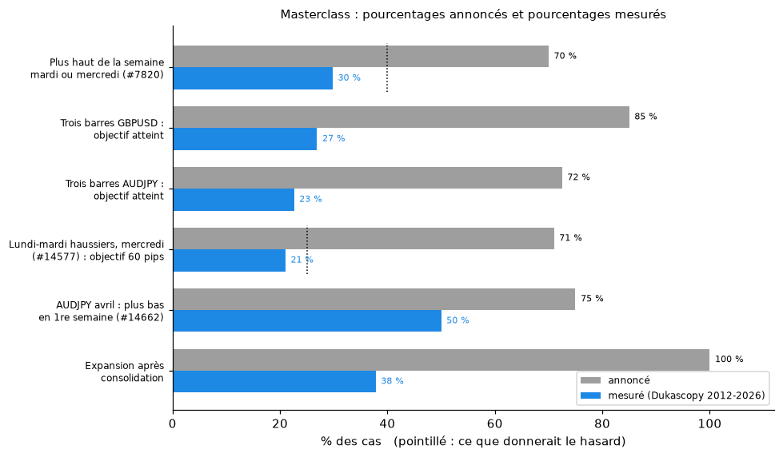
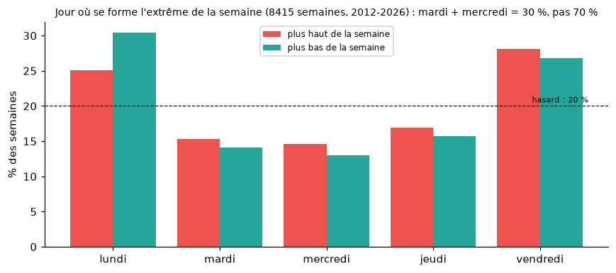
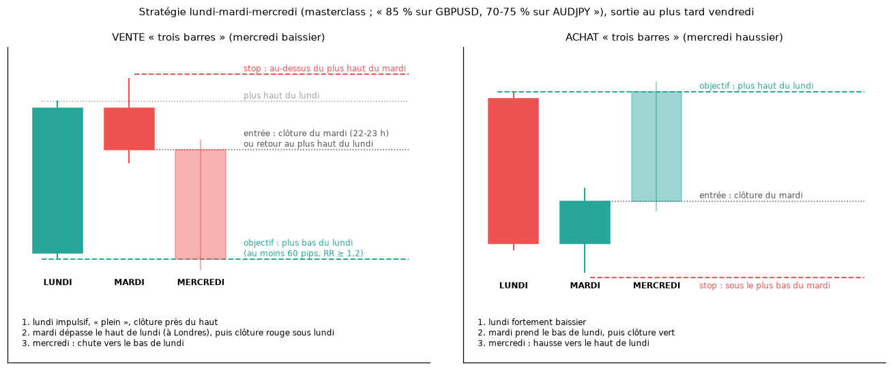
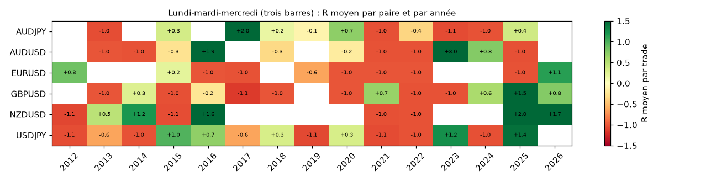
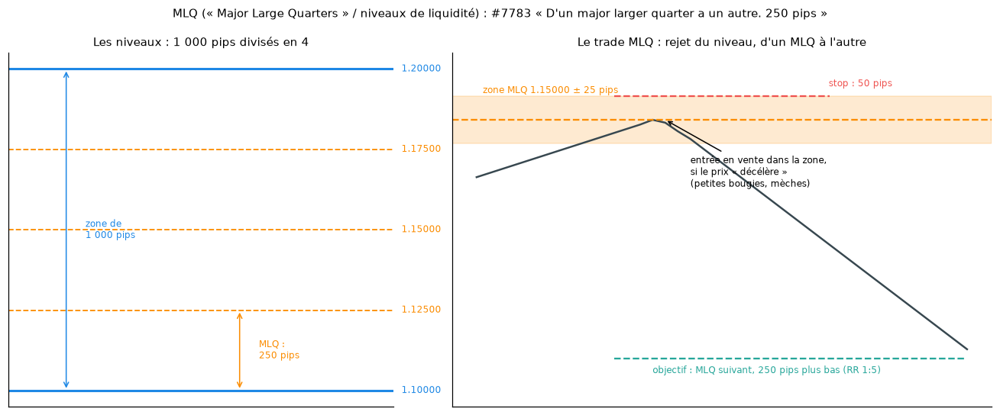
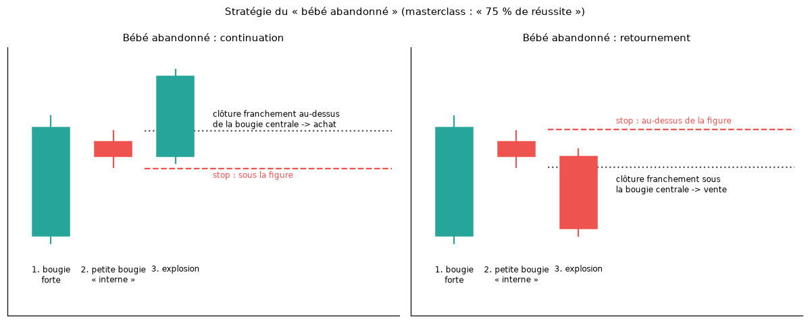
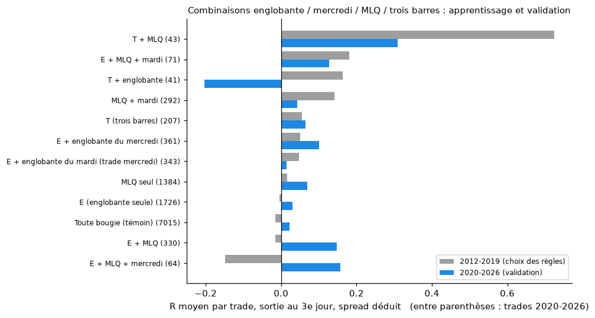

# La masterclass d'Amirou vérifiée sur les cours réels (2012-2026)

> **Données** : bougies journalières Dukascopy du 2 janvier 2012 au 1er octobre 2026 ([`data/prix/journalier_dukascopy.csv`](../data/prix/journalier_dukascopy.csv)). 2026 est complété par l'horaire Yahoo regroupé par jour, car Dukascopy ne publie le fichier annuel qu'en fin d'année. Pour la Bombe, le bébé abandonné en horaire et la variante « Londres » : bougies horaires Yahoo, décembre 2023 – septembre 2026.
> **Paires** : **EURUSD, GBPUSD, USDJPY, AUDJPY, AUDUSD, NZDUSD** dans cette version. USDCAD, GBPJPY, EURJPY, EURNZD et l'or sont en cours de téléchargement : Dukascopy limite le débit à quelques fichiers par minute. Les scripts les intégreront sans modification. Il suffit de relancer la commande de la section 8.
> **Scripts** :
> - [`scripts/tester_masterclass.py`](../scripts/tester_masterclass.py) (T1 à T8) ;
> - [`scripts/strategie_combinee.py`](../scripts/strategie_combinee.py) (combinaisons) ;
> - [`scripts/tester_bebe_abandonne.py`](../scripts/tester_bebe_abandonne.py) ;
> - [`scripts/tester_strategie_bombe.py`](../scripts/tester_strategie_bombe.py) ;
> - [`scripts/analyse_par_paire.py`](../scripts/analyse_par_paire.py).
>
> **Résultats bruts** :
> - [`data/masterclass_resultats.json`](../data/masterclass_resultats.json) ;
> - [`data/masterclass_trades.csv`](../data/masterclass_trades.csv) ;
> - [`data/strategie_combinee.csv`](../data/strategie_combinee.csv) ;
> - [`data/strategie_combinee_trades.csv`](../data/strategie_combinee_trades.csv).
>
> **Détail par paire et par année** : [`STRATEGIES_PAR_PAIRE.md`](STRATEGIES_PAR_PAIRE.md).

## En bref



| Affirmation de la masterclass | Annoncé | Mesuré 2012-2026 | Verdict |
|---|---|---|---|
| Le plus haut de la semaine se forme le mardi ou le mercredi | 70 % | **30 %** (le hasard donnerait 40 %) | ❌ c'est l'inverse : lundi et vendredi dominent |
| « Trois barres » lundi-mardi-mercredi sur GBPUSD | 85 % | objectif atteint **27 %**, −0,06 R | ❌ |
| « Trois barres » sur AUDJPY | 70-75 % | objectif atteint **23 %**, −0,13 R | ❌ |
| Lundi et mardi haussiers, mercredi prend le high (#14577) | 21 cas en 5 ans, 71 % | **380 cas** en 5 ans (6 paires), **22 %** d'objectifs, −0,11 R | ❌ |
| AUDJPY en avril : plus bas du mois en 1re semaine (#14662) | 75 % | **50 %** (2015-2024) | ❌ |
| MLQ : zone ±25 pips, stop 50, objectif 250 (1:5) | rentable dès 17 % de réussite | **15,6 %**, −0,05 R ; niveaux décalés : −0,07 à −0,09 R | ❌ aucun avantage |
| Après une consolidation, l'expansion suit « systématiquement » | ~100 % | **38 %** (et 47 % de retours au milieu du range) | ❌ |
| AUDUSD et NZDUSD corrélés « de l'ordre de 80 % » | 80 % | **0,83** (de 0,65 à 0,92 selon l'année) | ✅ |
| Bébé abandonné : la 4e bougie explose dans le sens des deux bougies de même couleur | « très fiable » | **46 à 50 %**, comme le témoin | ❌ |
| Bombe (H1) sur les paires en yen | « favorable » | 10 trades, 1 gagnant | ❔ trop peu de cas, pas confirmé |
| Combinaison **trois barres + MLQ** (testée ici, pas dans la masterclass) | — | +0,66 R (2012-2019, t = 3,3), **+0,18 R (2020-2026, t = 0,9)** ; meilleure que des niveaux décalés | 🔎 **seule piste qui sort du lot**, mais elle s'affaiblit hors échantillon : non prouvée |

**Conclusion** : aucun des pourcentages de la masterclass ne se retrouve sur 15 ans de cours. Certains sont même inversés (jour du plus haut, consolidation). Ces chiffres ressemblent à des souvenirs de cas marquants ou à des comptages sur une courte période choisie. Ce ne sont pas des statistiques. La seule affirmation confirmée est la corrélation AUDUSD/NZDUSD, un fait connu. Une seule combinaison sort du lot (section 6), mais elle s'affaiblit hors échantillon.

## Méthode commune
- **Une règle = un algorithme** : chaque règle de la masterclass est traduite en conditions chiffrées sur les bougies, sans regarder le résultat avant. Quand la masterclass est floue (« bougie pleine »), le choix est indiqué.
- **Prudence** :
  - si l'objectif et le stop sont touchés le même jour, on compte le stop ;
  - le jour de l'entrée, seul le stop compte, car l'ordre des prix dans la bougie est inconnu ;
  - le spread est déduit.
- **Témoin** : chaque stratégie est comparée à la même règle appliquée au hasard (toute bougie, ou niveaux décalés). Un résultat ne compte que s'il fait mieux que son témoin.
- **Validation** :
  - les combinaisons sont choisies sur 2012-2019, puis vérifiées une seule fois sur 2020-2026 ;
  - par paire, on vérifie que les « meilleures paires » d'une période restent les meilleures sur l'autre.

> **Correction d'un bug pendant ce travail (T5, MLQ)** : la première version entrait au bord éloigné de la zone (MLQ + 25 pips pour une vente) alors que la condition ne vérifiait que le bord proche. Elle comptait donc des trades remplis à un prix jamais atteint. Elle choisissait aussi le niveau juste sous le plus haut du jour, ce qui écartait les niveaux traversés, donc perdants. Résultat faux : +0,55 R. Après correction : −0,04 R. Les niveaux décalés de 50 ou 125 pips donnent le même ordre de grandeur, ce qui confirme que le contrôle fonctionne.

## 1. Le jour du plus haut et du plus bas de la semaine (T1)



Sur 4 602 semaines (6 paires) :

| | Lundi | Mardi | Mercredi | Jeudi | Vendredi | Mardi + mercredi |
|---|---|---|---|---|---|---|
| Plus haut de la semaine | 24,7 % | 15,5 % | 14,6 % | 18,0 % | 27,2 % | **30,1 %** |
| Plus bas de la semaine | 29,8 % | 14,4 % | 13,0 % | 15,2 % | 27,6 % | **27,4 %** |

- Les extrêmes de la semaine se forment surtout **le lundi et le vendredi**, aux bords de la semaine. C'est un effet mécanique : le premier et le dernier jour ont plus de chances d'être les extrêmes d'une marche au hasard.
- Le conseil « ne pas trader le lundi et le vendredi parce que les extrêmes se font mardi-mercredi » (#7820) ne s'appuie donc pas sur les données.

## 2. Lundi-mardi-mercredi : les « trois barres » (T2)



**Règle testée**, en vente (l'achat est symétrique) :
- **lundi** haussier « plein » : corps ≥ 60 % du range, clôture dans le quart haut ;
- **mardi** rouge, qui clôture sous la clôture du lundi ;
- **entrée** à la clôture du mardi ;
- **stop** 2 pips au-dessus du plus haut du mardi ;
- **objectif** : plus bas du lundi, au moins 60 pips et RR ≥ 1,2 (filtre de la masterclass) ;
- sortie au plus tard le vendredi.

| Version | Trades | Objectif atteint | Gagnants | R moyen |
|---|---|---|---|---|
| Toutes les configurations (sans filtre) | 548 | 48,5 % | 50,9 % | −0,06 |
| **Avec le filtre 60 pips et RR ≥ 1,2** | **142** | **24,6 %** | 35,2 % | **−0,06** |
| Filtre + le mardi dépasse d'abord le plus haut du lundi | 110 | 26,4 % | 37,3 % | −0,04 |
| Filtre + plus haut du mardi fait à Londres (2024-2026) | 12 | 42 % | 50 % | +0,63 |
| Filtre + plus haut du mardi hors de Londres (2024-2026) | 21 | 33 % | 43 % | +0,44 |

| Paire | Trades | Objectif | Gagnants | R moyen |
|---|---|---|---|---|
| GBPUSD | 26 | 26,9 % | 34,6 % | −0,06 |
| EURUSD | 18 | 11,1 % | 33,3 % | −0,34 |
| AUDJPY | 31 | 22,6 % | 32,3 % | −0,13 |
| USDJPY | 36 | 30,6 % | 38,9 % | +0,03 |
| AUDUSD | 19 | 15,8 % | 31,6 % | −0,25 |
| NZDUSD | 12 | 41,7 % | 41,7 % | +0,56 |



- **Le setup est rare** : 0,13 par mois et par paire, soit moins de 2 par an et par paire, et environ 10 par an sur les 6 paires.
- **85 % sur GBPUSD n'est pas retrouvé** : 27 % d'objectifs sur 15 ans.
- **Depuis 2024 en revanche, GBPUSD fait +0,87 R** sur 8 trades (5 gagnants) :
  - gagnants : 03/04/2024, 05/06/2024, 30/04/2025, 07/01/2026, 11/03/2026 ;
  - perdants : 11/09/2024, 04/06/2025, 20/05/2026.

  Si la masterclass a été construite sur ces dernières années, cela peut expliquer l'impression de fiabilité. Mais 8 trades ne prouvent rien, et 2012-2023 est négatif.
- La variante « Londres » repose sur 12 et 21 trades : trop peu pour conclure.
- NZDUSD est positive (+0,56 R), mais sur 12 trades seulement.

## 3. « Lundi et mardi haussiers, mercredi prend le high » (T3, #14577-#14579)

**Annoncé** : 21 fois en 5 ans, 71 % de réussite avec stop 20 pips et objectif 60 pips.

**Mesuré** :
- sur les 5 dernières années (depuis mars 2021), le schéma se produit **380 fois** sur 6 paires (56 fois sur EURUSD seul), et non 21 ;
- vente au plus haut du mardi quand mercredi le dépasse : **22 % d'objectifs**, 25 % de gagnants, **−0,11 R** par trade ;
- avec un stop de 20 pips pour un objectif de 60, le hasard donnerait 25 % : le résultat est même un peu pire, car un mercredi qui dépasse le plus haut du mardi continue souvent de monter ;
- sur 2012-2026 : 945 trades, 22,0 %, −0,12 R. Aucune paire n'est rentable de façon stable : AUDUSD fait +0,24 R sur 5 ans mais +0,08 sur 15 ans ; GBPUSD +0,09 R sur 5 ans, mais négative avant.

## 4. AUDJPY en avril, et le « plus bas du mois en 1re semaine » (T4, #14662)

| Paire | Avril 2015-2024 : plus bas en semaine 1 | Repli moyen sous l'ouverture du mois | Avrils haussiers | Tous les mois : plus bas en semaine 1 | **Mois haussiers** : plus bas en semaine 1 |
|---|---|---|---|---|---|
| **AUDJPY** | **50 %** (annoncé : 75 %) | 176 pips (annoncé : 91) | 70 % | 45 % | **72 %** |
| EURUSD | 20 % | 201 pips | 50 % | 35 % | 60 % |
| GBPUSD | 40 % | 274 pips | 70 % | 32 % | 58 % |
| USDJPY | 50 % | 193 pips | 60 % | 43 % | 68 % |

- **D'où vient probablement le « 75 % »** : quand un mois **finit en hausse**, son plus bas est souvent au début (72 % sur AUDJPY). C'est automatique : si le prix monte, le point bas est plutôt au début.
- Mais on ne sait pas à l'avance si le mois finira en hausse. Utilisé dans l'autre sens (« le plus bas sera en semaine 1, donc j'achète »), la règle ne vaut plus que 45-50 %.

## 5. MLQ, bébé abandonné, consolidation, Bombe

### MLQ ±25 / 50 / 250 pips (T5)



**Règle testée** :
- premier niveau de 250 pips rencontré à plus de 50 pips de la clôture de la veille ;
- entrée limite au bord de la zone de ±25 pips, stop 50 pips (l'autre bord), objectif 250 pips, sur 30 jours au maximum.

| Niveaux | Trades | Objectif | R moyen |
|---|---|---|---|
| **MLQ (multiples de 250 pips)** | 3 126 | **15,6 %** | **−0,05** |
| Niveaux décalés de 50 pips (témoin) | 3 111 | 15,5 % | −0,07 |
| Niveaux décalés de 125 pips, à mi-chemin (témoin) | 3 094 | 14,7 % | −0,09 |

- Il faut 16,7 % de réussite pour être à l'équilibre avec un ratio de 1:5 : le MLQ seul est **juste en dessous**, comme n'importe quel niveau.
- Les années vont de −0,32 R (2024) à +0,37 R (2021), sans régularité.
- Les MLQ font un peu mieux que les niveaux décalés (−0,05 contre −0,07 à −0,09 R), mais restent perdants : ils ne « tiennent » pas assez pour être tradés seuls.

### Bébé abandonné (définition corrigée)



**Définition** : bougies 1 et 3 de même couleur, bougie 2 de couleur opposée et englobée par les deux. Entrée à la clôture de la bougie 3 ; on regarde la bougie 4.

| Échelle | Figures | 4e bougie dans le sens annoncé | Témoin (même couleurs, sans englobement) | R moyen, objectif 1 R |
|---|---|---|---|---|
| Horaire, 13 paires, 2024-2026 (mèches englobées) | 2 578 | 46,5 % | 48,9 % | −0,17 (témoin −0,17) |
| Horaire (corps englobés) | 5 383 | 47,2 % | 48,9 % | −0,17 |
| Journalier, 6 paires, 2012-2026 (mèches) | 290 | 50,3 % | 48,8 % | −0,04 (témoin −0,07) |
| Journalier (corps) | 747 | 49,1 % | 48,8 % | +0,05 (t = 1,5) |

La 4e bougie part dans le sens annoncé **une fois sur deux**, exactement comme après n'importe quelles trois bougies. En horaire, le spread rend tout trade perdant.

### Consolidation puis expansion (T8)
Consolidation = 5 jours dans un range de moins de 1,5 ATR ; expansion = le prix avance d'1 ATR dans le sens de la cassure avant de revenir au milieu du range.

| Cassure | Cas | Expansion | Retour au milieu du range |
|---|---|---|---|
| Après une consolidation | 917 | **38 %** | **47 %** |
| Cassure ordinaire | 4 835 | 45 % | 28 % |

C'est **l'inverse** de l'affirmation : une cassure de range étroit revient plus souvent dans le range qu'elle ne s'étend (fausse cassure).

### Bombe (H1, 2024-2026, 13 paires)
- 46 trades, 35 % de gagnants, +0,11 R par trade (témoin +0,01 R).
- **Paires en yen** : 10 trades, **un seul gagnant** (EURJPY, 23/07/2024, +8,3 R). Les 9 autres sont des pertes ou de petits gains. Le +0,30 R moyen tient entièrement à ce trade.
- Avec 1,4 setup par mois, il faudrait plusieurs années pour savoir si la Bombe a un avantage. Rien ne permet de dire qu'elle est meilleure sur le yen.

### Corrélation AUDUSD / NZDUSD (T7)
- Corrélation des rendements journaliers sur 2012-2026 : **0,83**. C'est exact : la masterclass annonce « de l'ordre de 80 % ».
- Elle varie selon l'année : 0,65 en 2017, 0,92 en 2022, 0,83 en 2026.
- Conséquence pratique, juste aussi : prendre le même trade sur AUDUSD et NZDUSD revient presque à doubler le risque.

## 6. Combiner les briques : englobante, mercredi, MLQ, trois barres



**Briques** :
- **E** : englobante journalière ;
- **jour** : englobante formée le mardi ou le mercredi ;
- **M** : l'extrême de la bougie signal à moins de 25 pips d'un MLQ ;
- **T** : trois barres.

**Trade** : entrée à la clôture de la bougie signal, stop à l'autre extrême, objectif 1 R ou 2 R, ou sortie à la clôture du 3e jour. 12 combinaisons × 3 gestions = 36 essais, **choisis sur 2012-2019**. 6 paires.

| Combinaison (sortie au 3e jour) | 2012-2019 : trades, R | 2020-2026 : trades, R (t) |
|---|---|---|
| Toute bougie (témoin) | 12 488 ; −0,03 | 10 523 ; −0,01 (−0,9) |
| E (englobante seule) | 3 241 ; −0,02 | 2 643 ; 0,00 (0,1) |
| E + englobante du mercredi | 694 ; +0,04 | 543 ; +0,04 (0,7) |
| E + MLQ | 687 ; −0,02 | 512 ; +0,09 (1,6) |
| E + MLQ + mardi | 143 ; +0,14 | 103 ; +0,09 (0,7) |
| MLQ seul | 2 409 ; −0,01 | 2 121 ; +0,02 (0,7) |
| T (trois barres) | 332 ; +0,04 | 318 ; +0,06 (0,6) |
| **T + MLQ** | **75 ; +0,66 (t = 3,3)** | **60 ; +0,18 (0,9)** |
| T + englobante | 76 ; +0,14 | 73 ; −0,09 |

**La meilleure règle sur 2012-2019 est « trois barres + MLQ », sortie au 3e jour.** Ce qu'il faut en retenir :
- **Validation** : elle reste positive sur 2020-2026, mais tombe à +0,18 R par trade (60 trades, t = 0,9), ce qui n'est **plus significatif**. Avec les 4 premières paires seulement, la validation donnait +0,31 R : l'ajout d'AUDUSD (+0,07 R sur 26 trades) l'a fait baisser.
- **Contrôle des niveaux** : sur toute la période, les vrais MLQ donnent +0,45 R (135 trades). Avec des niveaux décalés de 50, 100, 125, 175 ou 200 pips, la même règle donne −0,12, −0,20, −0,01, +0,12 et −0,04 R. Les MLQ semblent donc apporter quelque chose ici, et c'est le seul cas.
- **Par paire** : +0,53 à +0,57 R sur 5 paires, +0,07 R sur AUDUSD. 8 années positives sur 15.
- **Limites** :
  - 135 trades en 15 ans sur 6 paires, soit environ 9 par an ;
  - 36 essais : le meilleur pouvait sortir par chance, et son résultat hors échantillon est 3,5 fois plus faible qu'en apprentissage, ce qui est typique d'un résultat en partie dû au hasard ;
  - à revérifier sur les 5 paires encore en téléchargement.
- **Occurrences depuis 2023** (date du mardi signal, sens, R au 3e jour) :
  - GBPUSD : 25/04/2023 vente −1,0 ; 17/09/2024 vente −1,0 ; 26/11/2024 achat +2,2 ; 13/01/2026 vente +0,7 ; 10/03/2026 vente +3,0 ; 05/05/2026 achat +1,1 ;
  - EURUSD : 18/06/2024 vente +1,9 ; 25/06/2024 vente −0,1 ; 04/08/2026 achat +0,8 ;
  - USDJPY : 24/12/2024 vente −1,0 ; 21/01/2025 achat +0,2 ; 22/04/2025 achat +0,3 ; 03/06/2025 achat +0,7 ; 14/10/2025 vente +1,2 ; 14/07/2026 vente −1,0 ;
  - AUDJPY : 02/05/2023 vente 0,0 ; 07/05/2024 −1,0 ; 03/09/2024 +1,2 ; 01/10/2024 −1,0 ; 10/12/2024 −1,0 ; 25/03/2025 −1,1 ; 17/06/2025 0,0 (toutes des ventes) ;
  - AUDUSD : 27/02/2024 achat −1,0 ; 03/06/2025 vente −1,0 ; 21/10/2025 vente −1,0 ; 04/08/2026 achat +0,4 ;
  - NZDUSD : 16/05/2023 vente −1,1 ; 22/10/2024 achat −1,1 ; 28/07/2026 achat +4,5.

  Liste complète : `data/par_paire/occurrences_trois_barres_mlq_sortie_au_3e_jour.csv`.

**Les autres combinaisons** font à peine mieux que le témoin. E + MLQ est positive en 2020-2026 (+0,09 R, t = 1,6) mais négative en 2012-2019 : c'est typiquement le genre de résultat qui ne se reproduit pas.

## 7. Ce qu'il faut retenir
1. **Les pourcentages de la masterclass (70 %, 75 %, 85 %) ne correspondent pas aux cours réels.** Sur 15 ans, les règles donnent 20 à 50 % selon les cas, souvent moins que le hasard une fois le spread déduit.
2. **Plusieurs affirmations sont à l'envers** :
   - les extrêmes de la semaine se font surtout le lundi et le vendredi ;
   - une cassure de consolidation est plus souvent fausse que vraie.
3. **Les « bons » chiffres viennent souvent d'un raisonnement après coup** : « le plus bas est en semaine 1 » est vrai pour les mois qui ont monté, mais on ne le sait qu'à la fin du mois.
4. **Ce qui est juste** : AUDUSD et NZDUSD sont bien corrélées à environ 80 %.
5. **Une piste à surveiller, pas à trader : trois barres + MLQ.** Elle est positive avant et après 2020 et meilleure que des niveaux quelconques. Mais sur 2020-2026, elle ne fait plus que +0,18 R, sans significativité, sur environ 9 trades par an. Il faudrait la suivre en temps réel pendant 1 à 2 ans, avec un journal daté de chaque setup, avant d'y engager de l'argent.

## 8. Relancer ou compléter
```bash
python scripts/prix_dukascopy_journalier.py --debut 2012 --paires EURUSD GBPUSD USDJPY AUDJPY AUDUSD NZDUSD USDCAD GBPJPY EURJPY EURNZD XAUUSD   # ajouter les paires téléchargées
python scripts/tester_masterclass.py && python scripts/strategie_combinee.py && python scripts/tester_bebe_abandonne.py
python scripts/analyse_par_paire.py && python scripts/figures_rapports.py
```
