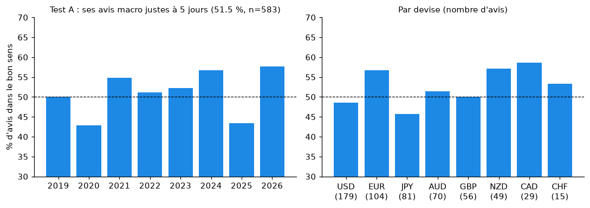
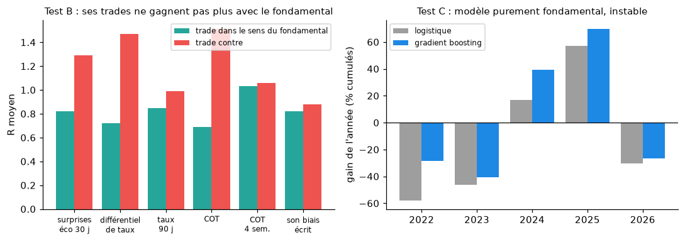
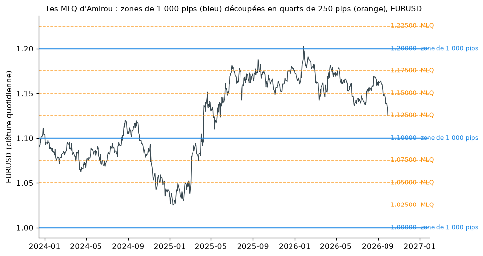
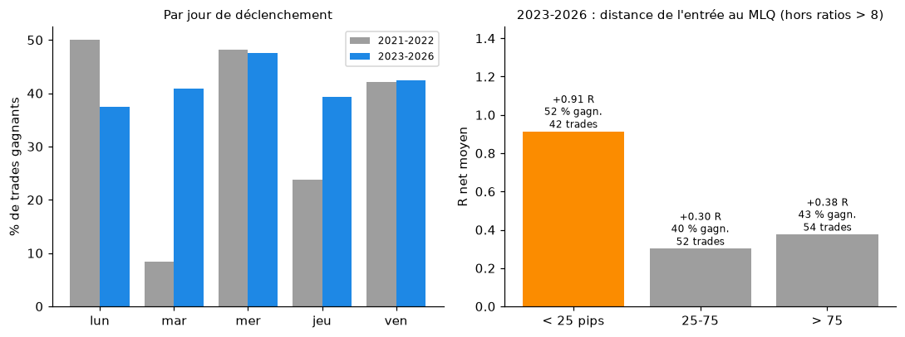
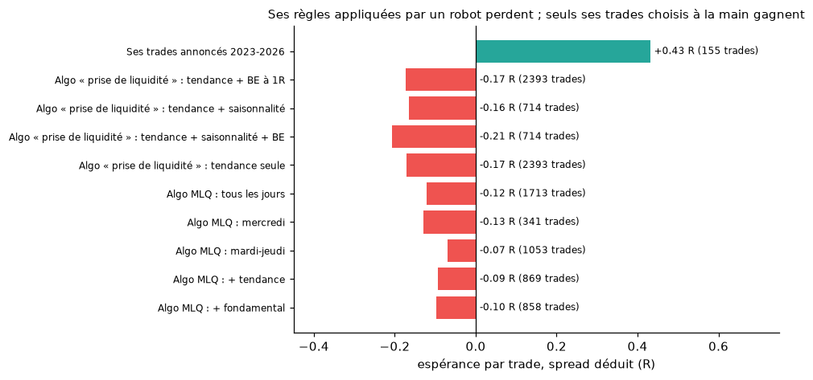

# Version fondamentale du modèle, habitudes MLQ et mercredi, évolution 2021-2026

> Suite de [`STRATEGIE_ET_MODELE.md`](STRATEGIE_ET_MODELE.md). Tous les résultats se recalculent avec les scripts cités.
>
> **Scripts** :
> - [`scripts/collecter_fondamentaux.py`](../scripts/collecter_fondamentaux.py) : calendrier économique, COT, taux directeurs ;
> - [`scripts/biais_textuel.py`](../scripts/biais_textuel.py) : biais haussier ou baissier d'Amirou par devise, lu dans le canal et les rapports SignalX ;
> - [`scripts/modele_fondamental.py`](../scripts/modele_fondamental.py) : indicateurs par devise et tests A, B, C ;
> - [`scripts/algo_mlq_backtest.py`](../scripts/algo_mlq_backtest.py) : habitudes MLQ et mercredi sur ses trades, puis algorithme de rejet des MLQ.
>
> **Fichiers produits** : `data/fondamental/` (calendrier.csv, cot.csv, taux.csv, biais_amirou.csv, indicateurs.csv, resultats_tests.json) et `data/backtest_mlq.csv`.

## 1. Les données fondamentales collectées

| Source | Contenu | Volume |
|---|---|---|
| Calendrier économique TradingView | annonces US, zone euro, Allemagne, Royaume-Uni, Japon, Australie, Nouvelle-Zélande, Canada, Suisse, Chine : valeur publiée, consensus, précédente, importance (2019-2026) | 71 027 annonces |
| CFTC « Traders in Financial Futures » | positions nettes des fonds à effet de levier et des gérants d'actifs sur 8 devises, datées du vendredi de publication, juin 2006 – sept. 2026 | 8 469 semaines × devise |
| BIS (WS_CBPOL) | taux directeurs quotidiens des 8 banques centrales | 17 575 lignes |
| Texte d'Amirou | 910 phrases orientées (canal + PDF SignalX), précision du lexique ≈ 80 % sur 20 phrases vérifiées à la main | 640 jours × devise |

Indicateurs par devise et par jour, tous connus à la date du jour (pas de fuite d'information) :
- **surprise_30j** : somme sur 30 jours des écarts « publié − consensus », normalisés par indicateur, inversés pour le chômage et les inscriptions ;
- **taux** et **taux_90j** : niveau du taux directeur et variation sur 90 jours ;
- **cot** et **cot_4s** : position nette des fonds en % de l'intérêt ouvert, et sa variation sur 4 semaines ;
- **amirou_14j** : son biais exprimé sur les 14 derniers jours.

Pour une paire, l'indicateur vaut devise de base − devise de cotation.

## 2. Test A : sa lecture macro est-elle juste ?

On compare chaque avis d'Amirou sur une devise (« dollar baissier », « vendre EURUSD »…) au mouvement de cette devise contre un panier des 7 autres sur les 5 jours suivants.

**583 avis : 51,5 % dans le bon sens.** C'est le hasard.

| 2019 | 2020 | 2021 | 2022 | 2023 | 2024 | 2025 | 2026 |
|---|---|---|---|---|---|---|---|
| 50 % | 43 % | 55 % | 51 % | 52 % | 57 % | 43 % | 58 % |

Par devise, de 46 % (yen) à 59 % (dollar canadien, 29 avis seulement). Le dollar, la devise qu'il commente le plus (179 avis), est à 49 %.

## 3. Test B : ses trades gagnent-ils plus quand les fondamentaux vont dans leur sens ?

243 trades annoncés et terminés (gagnants, R moyen) :

| Indicateur | Trade dans le sens | Trade contre |
|---|---|---|
| Surprises économiques 30 j | 125 : 40 %, +0,82 R | 118 : 42 %, +1,29 R |
| Différentiel de taux | 129 : 40 %, +0,72 R | 112 : 43 %, +1,47 R |
| Variation des taux 90 j | 82 : 43 %, +0,85 R | 59 : 42 %, +0,99 R |
| COT (niveau) | 137 : 39 %, +0,69 R | 106 : 43 %, +1,51 R |
| COT (variation 4 sem.) | 115 : 43 %, +1,03 R | 128 : 38 %, +1,06 R |
| Son propre biais écrit (14 j) | 87 : 40 %, +0,82 R | 49 : 37 %, +0,88 R |

- **Aucun indicateur fondamental n'améliore ses trades.** Aller contre le différentiel de taux ou contre le positionnement des fonds fait même un peu mieux : c'est cohérent avec son style de « retournement ».
- La **variation du COT sur 4 semaines** donne un peu plus de gagnants dans le sens du trade (43 % contre 38 %), mais le même R moyen (+1,03 contre +1,06) : pas d'avantage.
- Ses trades ne sont pas plus gagnants quand ils suivent ce qu'il a écrit lui-même sur la devise.
- **Méta-modèle** (gradient boosting, entraîné sur le passé, testé année par année) avec ces indicateurs en plus : **AUC 0,533**. La moitié des trades jugée la meilleure fait +0,45 R, l'autre +0,41 R. Pas d'amélioration exploitable.

## 4. Test C : un modèle purement fondamental

Modèle hebdomadaire sur 13 paires, 2022-2026 (4 420 semaines × paire), entraîné sur le passé, coût de 0,015 % par trade :

| Année | AUC logistique | Gain logistique | AUC gradient boosting | Gain GB |
|---|---|---|---|---|
| 2022 | 0,48 | −58 % | 0,47 | −28 % |
| 2023 | 0,48 | −46 % | 0,48 | −41 % |
| 2024 | 0,54 | +17 % | 0,54 | +39 % |
| 2025 | 0,57 | +57 % | 0,55 | **+70 %** |
| 2026 | 0,53 | −30 % | 0,51 | −26 % |

(somme des % de chaque trade hebdomadaire, sans levier)

**AUC globale 0,51.** L'excellente année 2025 est suivie d'une perte en 2026 : le modèle n'est pas stable. Les repères simples (portage de taux −0,001 %, surprises +0,004 %, biais d'Amirou +0,005 % par semaine) sont tous proches de zéro.

## 5. Ses habitudes : MLQ et mercredi

### Ce qu'il en dit
Les **MLQ (Major Large Quarters)** découpent des zones de 1 000 pips en quarts de 250 pips : 1.10000, 1.12500, 1.15000… (2,50 yens sur les paires en JPY). 34 messages en parlent, par exemple :
- #6913, #6948, #7450 ;
- #7783 : « D'un major larger quarter à un autre. 250 pips » ;
- #8499 (1.67500), #11049 (192.500), #11642 (1.95000).

Le mercredi revient souvent comme jour de placement des ordres (#1351, #1352).

### Ce que montrent ses trades (246 annoncés et terminés)
- **29 % des entrées sont à moins de 25 pips d'un MLQ**, contre 20 % pour une entrée tirée au hasard. L'habitude est réelle, mais elle ne concerne qu'un trade sur trois environ.
- Près d'un MLQ : 72 trades, 44 % gagnants, +1,14 R. Loin : 174 trades, 39 %, +1,10 R.
- **Le mercredi est son jour le plus actif et le plus réussi** :

| Jour de déclenchement | Trades | Gagnants | R moyen |
|---|---|---|---|
| Lundi | 20 | 45 % | +2,34 R (petit échantillon, gonflé par quelques ratios extrêmes) |
| Mardi | 56 | 34 % | +0,25 R |
| **Mercredi** | **69** | **48 %** | **+1,49 R** |
| Jeudi | 49 | 33 % | +0,83 R |
| Vendredi | 52 | 42 % | +1,34 R |

Le jeudi faible confirme ce qu'il écrit lui-même (« le jeudi je touche souvent SL ou BE », #14517).

### Un algorithme MLQ mécanique
Règle : pendant Londres et New York, une bougie horaire touche un MLQ (à 3 pips près) et clôture à 10 pips ou plus de l'autre côté ; entrée à la clôture dans le sens du rejet, stop à 5 pips au-delà de la mèche, objectif 2,5 R, spread déduit. 13 paires, décembre 2023 à septembre 2026.

| Variante | Trades | Espérance |
|---|---|---|
| Tous les jours | 1 713 | −0,12 R |
| Mercredi seulement | 341 | −0,13 R |
| Mardi à jeudi | 1 053 | −0,07 R |
| + tendance (MM 20 j) | — | −0,09 R |
| + filtre fondamental | — | −0,10 R |
| Mercredi + tendance + fondamental | 91 | −0,15 R |

Par jour : le jeudi est le moins mauvais (−0,01 R), le vendredi le pire (−0,30 R).

**Toucher un MLQ ne suffit pas.** Le niveau sert à Amirou de repère pour placer l'entrée, mais c'est son choix du moment qui fait la différence, et ce choix ne se résume pas à « mercredi ».

## 6. Il a vraiment changé de manière de trader entre 2021 et 2026

Les trades rejoués le confirment, chiffres à l'appui (trades annoncés et terminés) :

| Année | Trades | Stop médian | Ratio médian | Gagnants | R hors ratios > 8 | Entrées près d'un MLQ | Déclenchés un mercredi | Captures publiées après coup |
|---|---|---|---|---|---|---|---|---|
| 2021 | 58 | 10 pips | 1:9,9 | 40 % | +0,27 R | 19 % | 26 % | 13 % |
| 2022 | 33 | 16 pips | 1:6,5 | 30 % | +0,69 R | **48 %** | 36 % | 20 % |
| 2023 | 60 | 50 pips | 1:3,6 | 43 % | **+0,98 R** | 13 % | 23 % | 10 % |
| 2024 | 28 | 51 pips | 1:3,1 | 32 % | −0,01 R | 32 % | 14 % | **36 %** |
| 2025 | 36 | 40 pips | 1:2,2 | 44 % | +0,49 R | **47 %** | 33 % | **38 %** |
| 2026 | 31 | 40 pips | 1:2,1 | 48 % | +0,31 R | 35 % | **39 %** | **39 %** |

Ce qui change :
1. **Le risque** : stops de 10-16 pips et ratios de 1:7 à 1:10 en 2021-2022 (style Wyckoff / smart money, entrées « sniper »), puis stops de 40-50 pips et ratios de 1:2 à 1:3,5 à partir de 2023. Le taux de réussite monte un peu, le gain par trade gagnant baisse beaucoup.
2. **Les MLQ** : très présents en 2022 (époque des « quarter points »), quasi absents en 2023 (année fondamentale), puis de retour en 2025-2026.
3. **Le mercredi** prend de plus en plus de place : 39 % des déclenchements en 2026.
4. **La part de captures publiées après coup triple** à partir de 2024 (de 10-20 % à 36-39 %). Une part croissante de ce qui est montré dans le canal n'était donc pas annoncée à l'avance.

**Ce qui marche selon l'époque** :
- 2021-2022 : le mercredi (48 %, +0,68 R) et le vendredi (+1,17 R) ; le mardi est catastrophique (1 gagnant sur 12) ; près ou loin d'un MLQ, c'est pareil (37 % contre 36 %).
- **2023-2026 : les entrées près d'un MLQ font nettement mieux** (45 trades, 49 % gagnants, +0,96 R, contre 40 % et +0,38 R loin d'un MLQ, hors ratios > 8). Le mercredi reste le meilleur jour en taux (48 %).

C'est le signal le plus net trouvé dans ses propres trades. Il reste fragile (45 trades), et l'algorithme MLQ mécanique montre qu'il ne suffit pas à lui seul : il faudrait le tester sur ses futurs trades avant de s'y fier.

**Conséquence pour les modèles** : mélanger 2021 et 2026 revient à apprendre deux stratégies différentes en une seule. C'est une des raisons pour lesquelles le modèle d'IA ne dépasse pas le hasard. Sur la seule période 2023-2026, il reste environ 155 trades, trop peu pour un modèle fiable.

## 7. Conclusion

- **Ajouter les fondamentaux ne permet pas de copier Amirou.** Sa lecture macro écrite est juste une fois sur deux (51,5 %), ses trades ne gagnent pas plus quand les fondamentaux vont dans leur sens, et un modèle purement fondamental est instable (AUC 0,51).
- **Ses habitudes MLQ et mercredi sont réelles et mesurables.** Les entrées près d'un MLQ depuis 2023 et le mercredi sont ses meilleurs trades. Mais un robot qui trade les rejets de MLQ le mercredi perd de l'argent (−0,13 R par trade).
- **Son avantage, modeste, vient de la sélection** : quel niveau, quelle paire, quel mercredi. Aucune des données testées (prix, saisonnalité, calendrier, COT, taux, son propre texte) ne permet de reproduire cette sélection.
- **Piste réaliste** : suivre à partir de maintenant ses trades annoncés à l'avance, en notant pour chacun la distance au MLQ et le jour, et vérifier dans quelques mois si l'avantage « MLQ + mercredi » de 2023-2026 se confirme.

### Limites
- Lexique de sentiment simple (≈ 80 % de précision) ; un modèle de langage ferait mieux, mais le test A ne montrerait sans doute pas un écart très différent.
- Le calendrier TradingView ne donne pas toujours le consensus des petits indicateurs ; ils sont alors ignorés.
- Les données horaires Yahoo ne commencent qu'à mi-décembre 2023 : l'algorithme MLQ n'est testé que sur 2 ans et 9 mois.
