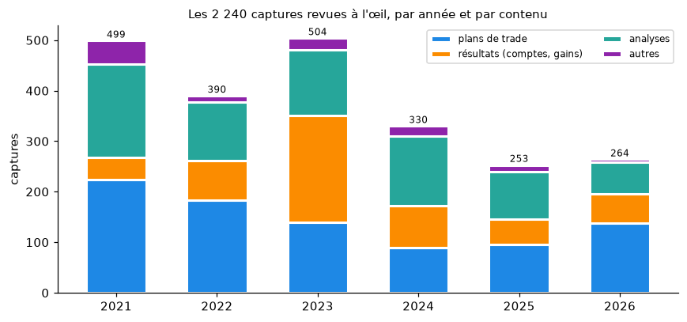
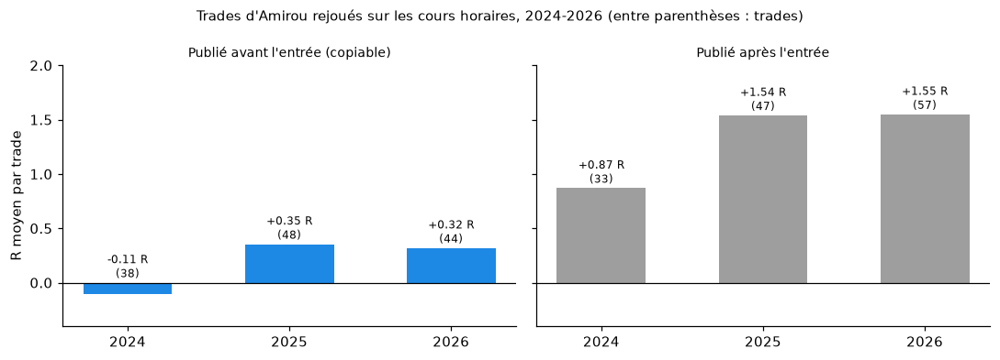

# Revue visuelle des 2 240 captures restantes (2021-2026)

*Rédigé le 06/10/2026.*

**Données et scripts** :
- revue capture par capture : [`data/revue_visuelle_captures.csv`](../data/revue_visuelle_captures.csv) ;
- trades rejoués sur les cours : [`data/revue_trades_simules.csv`](../data/revue_trades_simules.csv), avec [`scripts/rejouer_revue_visuelle.py`](../scripts/rejouer_revue_visuelle.py).

## Ce qui a été fait

- **Point de départ.** L'OCR (`scripts/lire_captures_ocr.py`) avait tiré 518 trades exploitables des captures. Il restait **2 240 images** : photos d'écran de téléphone, comptes MT4/MT5/cTrader, tableaux de bord de sociétés de financement, schémas, etc.
- **Lecture.** Chacune a été regardée à l'œil, par planches de quatre.
- **Fiche par image.** Pour chacune :
  - id du message et date (UTC) ;
  - catégorie : `trade`, `resultat`, `analyse` ou `autre` ;
  - paire, sens et unité de temps ;
  - entrée, stop et objectif quand ils sont lisibles ;
  - une note qui indique **qui** publie : Amirou (comptes « BLACKMAKER » sur TradingView, « touramirou » sur les classements), un membre ou un tiers.
- **Règles du projet** (CLAUDE.md) :
  - un gain « flottant » n'est pas un TP ;
  - une capture de membre n'est pas un trade d'Amirou ;
  - une simulation sur données passées (FX Replay, « journal de backtest ») n'est pas un résultat réel.

## 1. Ce que contiennent les captures

| Année | Trades (plans) | Résultats (comptes, gains) | Analyses | Autres | Total | dont membres ou tiers |
|---|---|---|---|---|---|---|
| 2021 | 224 | 44 | 185 | 46 | 499 | 88 |
| 2022 | 184 | 77 | 116 | 13 | 390 | 151 |
| 2023 | 140 | 211 | 130 | 23 | 504 | 33 |
| 2024 | 89 | 84 | 137 | 20 | 330 | 8 |
| 2025 | 95 | 51 | 93 | 14 | 253 | 8 |
| 2026 | 138 | 58 | 63 | 5 | 264 | 2 |
| **Total** | **870** | **525** | **724** | **121** | **2 240** | **290** |

**Évolution du contenu** :
- **2021-2022** : beaucoup de captures de membres et d'élèves (comptes FTMO et My Forex Funds), un peu de crypto (11 captures), des stops très serrés (10-16 pips).
- **2023** : l'année des **comptes financés**. 211 captures de résultats : phases réussies chez True Forex Funds, My Forex Funds, Nova Funding, AQRE FX et FTMO, demandes de paiement, classements.
  - Exemples : #7426, #7427, #7898, #8602 ; Nova Funding 200 000 $ porté à 216 227 $, « 93 % de gagnants » (#9366).
- **Depuis 2024** : surtout des plans TradingView (« BLACKMAKER ») et des positions MT5 en cours. Les comptes de membres disparaissent presque.
  - En 2025-2026, Amirou apparaît dans les classements Trading Cult (« touramirou », 1er avec +10,88 % le 28/10/2025, #14110).

**Paires des 720 trades d'Amirou** (hors membres) :
- EURUSD : 100 ;
- GBPUSD : 61 ;
- AUDJPY : 48 ;
- USDJPY : 46 ;
- EURNZD : 42 ;
- GBPJPY et EURJPY : 40 chacune ;
- EURAUD : 39.

En 2026 apparaissent aussi EURNOK (« EURNOK ~ 1/USOIL », #14951), le Dow Jones et le pétrole.

## 2. Ce qui est montré, et ce qui ne l'est pas

- **525 captures de résultats, dont 56 seulement laissent voir une perte.**
  - Les captures montrent surtout des positions gagnantes, souvent **en gain flottant** (70 captures « flottant »).
  - On ne peut rien en déduire sur le taux de réussite : ce sont les trades qu'Amirou a choisi de montrer.
- **Les pertes visibles**, toutes sur des historiques de compte publiés par Amirou lui-même :

| Date | Message | Ce qu'on voit |
|---|---|---|
| 02/02/2023 | #7353 | EURJPY buy 5.14 clôturé −857 $ |
| 13/04/2023 | #7893 | AUDJPY −939 $ et −607 $, compensés par XAUUSD +11 063 $ |
| 27/07/2023 | #8788 | **compte de 500 000 $ : AUDJPY −5 307 $** |
| 02/10/2023 | #9466-#9469 | EURJPY −1 259 $, −2 524 $, −640 $ ; GBPJPY −772 $ (semaine gagnante grâce à EURUSD) |
| 13/10/2023 | #9568 | GBPUSD buy 10 lots −2 650 $ (14 trades, total +12 709 $) |
| 20/12/2023 | #10100, #10101 | EURJPY −2 619 $ et −2 907 $ (semaine à +21 957 $) |
| déc. 2023-janv. 2024 | #10306 | **historique mensuel perdant : −16 287 $** (5 pertes GBPJPY de −1 223 à −2 303 $, GBPJPY −4 949 $, EURNZD −1 162 $) |
| 13/12/2023 | #10327 | message du canal : Amirou dit avoir perdu plus de 8 000 $ en restant baissier sur le yen |
| 23/01/2024 | #10496 | GBPJPY −1 019 $, après +3 023 $ de gain flottant |
| 05/04/2024 | #10906 | Amirou écrit que le NFP du 08/03/2024 lui a causé « d'énormes pertes » et a mis un compte Nova de 200 000 $ en drawdown |
| 12/02/2025 | #12903 | deux ventes EURUSD, −813 $ et −599 $ (CPI) |
| 11/02/2026 | #14414 | historique TradersTrust (200 000 $, déc. 2025-févr. 2026) : environ 40 trades, +7 301 $, plusieurs pertes de −1 000 à −2 060 $ |
| 03/03/2026 | #14483, #14484 | AUDCAD −1 010 $ et −1 050 $ |
| 16/09/2026 | #15374 | EURGBP −158 $ |

- **Ce que montrent ces pertes** :
  - le compte de 500 000 $, l'historique perdant de décembre 2023 et le compte Nova en drawdown montrent que les pertes existent ;
  - elles sont rarement montrées au moment où elles ont lieu.
  - L'effondrement de My Forex Funds (gel par la CFTC, août 2023, #9154) apparaît aussi dans le canal.
- **Pièces non probantes** (classées `autre`) :
  - **simulations FX Replay** : « +181 060 $, 88 % de gagnants » (#13169, #13170) et « +131 412 $, 80 % » (#14447) ;
  - « Analyse complète de performance », non sourcée : « 10 000 $ → 36 567 $, 80 % de réussite » (#13526) ;
  - relevé d'un portefeuille de 1,16 M$ dont le titulaire n'est pas identifiable (#13672).
- **Ce n'est pas un trade réel** : les camemberts « jour du plus haut de la semaine » (#11203, #11204) et les flashcards « Naruto » (#13327…) sont des statistiques présentées par Amirou. Elles ont été testées dans [`MASTERCLASS_VERIFIEE.md`](MASTERCLASS_VERIFIEE.md) et [`FLASHCARDS_ENGLOBANTE.md`](FLASHCARDS_ENGLOBANTE.md).

## 3. Les nouveaux trades d'Amirou rejoués sur les cours

- **Trades rejouables.** Sur les 720 plans d'Amirou, 269 ont une paire, un sens, une entrée, un stop et un objectif lisibles, et ne figuraient pas déjà dans `data/trades_simules.csv`.
- **Rejeu.** 188 ont pu être rejoués avec les mêmes règles que les trades OCR (`scripts/simuler_trades_dukascopy.py`). Les autres concernent des instruments sans cours (crypto) ou sont des doublons.

| Statut | 2021 | 2022 | 2023 | 2024 | 2025 | 2026 | Total |
|---|---|---|---|---|---|---|---|
| Publié avant l'entrée (copiable) | 34 | 13 | 19 | 15 | 16 | 22 | 119 |
| Publié **après** l'entrée (« après coup ») | 3 | 2 | 1 | 14 | 13 | 29 | 62 |
| Incohérent (prix déjà au-delà du stop) | 0 | 4 | 0 | 1 | 0 | 2 | 7 |

**Résultat des trades copiables qui se sont déclenchés** :

| Année | Trades | Objectifs | Stops | R moyen |
|---|---|---|---|---|
| 2021 | 28 | 4 | 24 | +0,12 |
| 2022 | 10 | 0 | 10 | −1,00 |
| 2023 | 12 | 3 | 9 | +0,33 |
| 2024 | 10 | 2 | 8 | −0,28 |
| 2025 | 12 | 4 | 8 | +0,08 |
| 2026 | 13 | 6 | 7 | +0,45 |
| **Total** | **85** | **19 (22 %)** | **66** | **+0,02** |

- **Après coup, c'est l'inverse.**
  - Les trades publiés après coup atteignent l'objectif 73 % du temps (+1,52 R).
  - Rien d'étonnant : Amirou publie surtout une position déjà en gain.
  - Depuis 2024, plus de la moitié des plans en photo sont publiés après l'entrée (56 sur 109).
- **Prudence pour 2021-2023.**
  - Avant décembre 2023, seuls des cours journaliers sont disponibles.
  - Quand une bougie touche à la fois le stop et l'objectif, on compte le stop.
  - Avec les stops de 10 à 16 pips de 2021-2022, cela pénalise fortement ces années.
  - **Seuls les chiffres de 2024-2026, en horaire, sont fiables.**
- **Avec les trades OCR déjà simulés**, sur 2024-2026 en horaire :
  - **130 trades copiables**, 40 % d'objectifs atteints, **+0,21 R** en moyenne (écart-type de la moyenne ±0,14) ;
  - 2024 −0,11 R, 2025 +0,35 R, 2026 +0,32 R ;
  - un léger avantage, pas significatif. Il dépend aussi des passages à BE, non simulés.

## 4. Ce qu'il faut retenir

1. **Toutes les images ont été vues.**
   - 2 240 captures restantes + 518 trades OCR = l'ensemble des captures 2021-2026 du canal.
   - La confrontation avec les messages texte, mois par mois, est dans [`TRADES_TOUS_LES_MOIS.md`](TRADES_TOUS_LES_MOIS.md).
2. **Les captures sont une vitrine.**
   - Une capture de résultat sur dix seulement laisse voir une perte.
   - Les gains affichés sont souvent flottants.
   - Une grande part des plans de 2024-2026 est publiée après l'entrée.
3. **Copiés à la publication, les trades d'Amirou ne donnent qu'un avantage faible et incertain** : +0,21 R par trade sur 2024-2026, non significatif.
4. **Des pertes importantes existent et sont documentées par Amirou lui-même** :
   - −5 307 $ sur un compte de 500 000 $ (#8788) ;
   - un mois à −16 287 $ (#10306) ;
   - plus de 8 000 $ perdus sur le yen (#10327) ;
   - un compte de 200 000 $ en drawdown après le NFP de mars 2024 (#10906).
5. **Les comptes financés réussis sont réels** (courriels de réussite, paiements) : ils montrent qu'Amirou a passé des évaluations. Ils ne disent rien des comptes perdus, qui ne sont jamais montrés.
