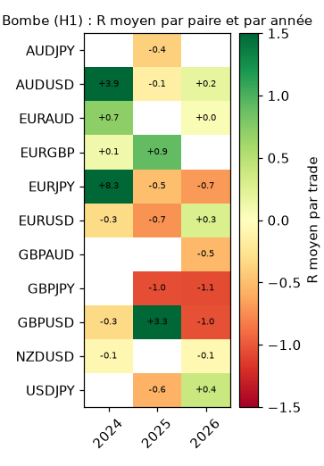
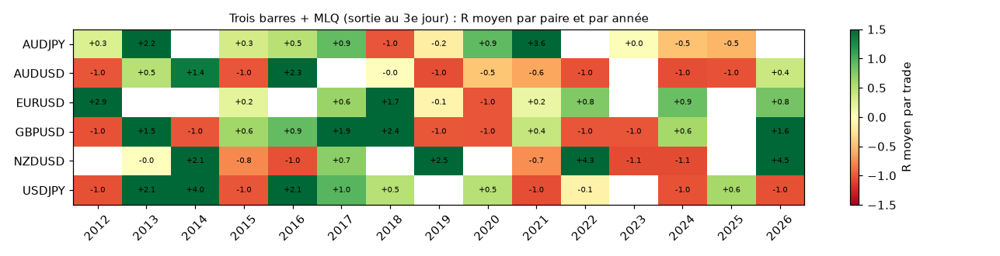
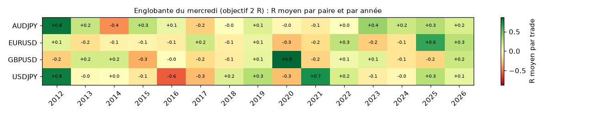
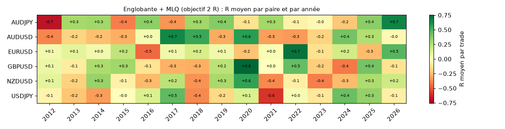
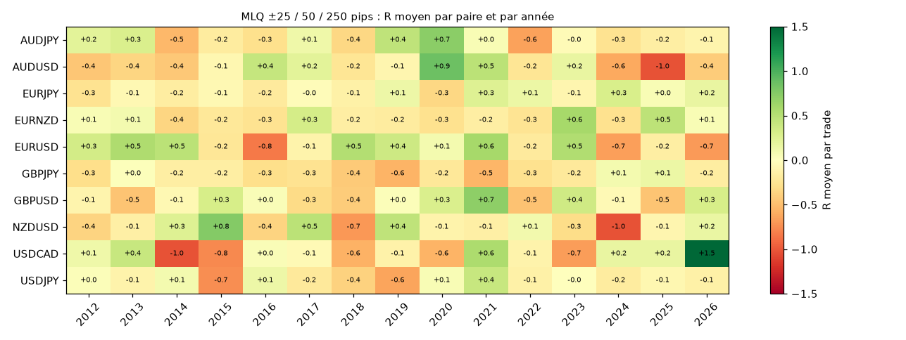
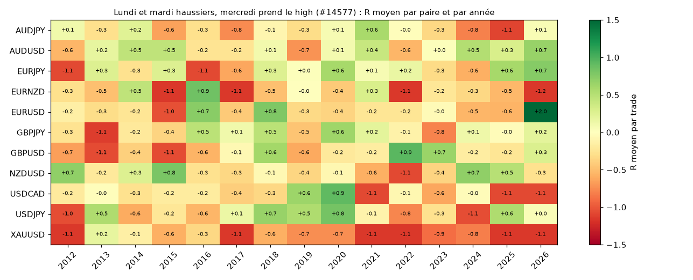
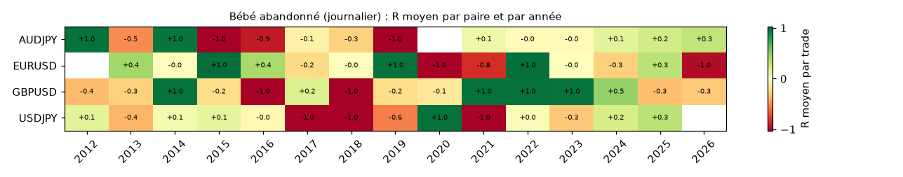
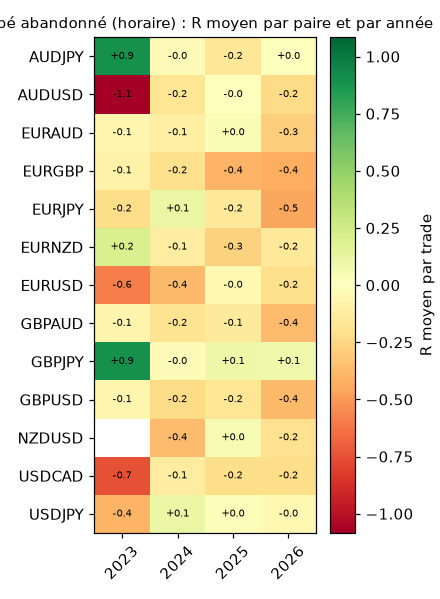
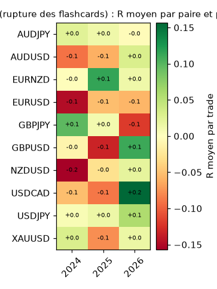

# Les stratégies paire par paire et année par année

> **Question posée** : les stratégies ne doivent pas être jugées globalement, mais paire par paire. Par exemple :
> - EURUSD et GBPUSD seraient plus favorables au lundi-mardi-mercredi ;
> - la Bombe serait favorable aux paires en yen.
>
> **Méthode** :
> - chaque stratégie est découpée par paire et par année ;
> - chaque occurrence est listée avec sa date et son résultat ;
> - on vérifie si une préférence pour certaines paires **se maintient d'une période à l'autre**, ou si elle est due au hasard.
>
> **Script** : [`scripts/analyse_par_paire.py`](../scripts/analyse_par_paire.py).
> **Tableaux complets** (paire × année) : [`annexes/STRATEGIES_PAR_PAIRE_TABLEAUX.md`](annexes/STRATEGIES_PAR_PAIRE_TABLEAUX.md).
> **Listes datées** : [`data/par_paire/occurrences_*.csv`](../data/par_paire/), une ligne par occurrence avec la date, la paire, le sens, l'entrée, le stop, l'objectif, l'issue et le résultat en R.
> **Données** :
> - stratégies journalières : 4 paires (EURUSD, GBPUSD, USDJPY, AUDJPY), 2012-2026 ; les autres paires sont en cours de téléchargement ;
> - Bombe, bébé abandonné horaire et englobante des flashcards : 10 à 13 paires, 2024-2026.
>
> Le détail des règles est dans [`MASTERCLASS_VERIFIEE.md`](MASTERCLASS_VERIFIEE.md) et les schémas dans [`GUIDE_STRATEGIES.md`](GUIDE_STRATEGIES.md).

## 1. Vue d'ensemble : R moyen par trade et par paire (nombre de trades)

| Stratégie | EURUSD | GBPUSD | USDJPY | AUDJPY | EURJPY | GBPJPY | AUDUSD | NZDUSD | USDCAD | EURNZD | XAUUSD |
|---|---|---|---|---|---|---|---|---|---|---|---|
| Lundi-mardi-mercredi (trois barres) | −0,34 (18) | −0,06 (26) | +0,03 (36) | −0,13 (31) | | | | | | | |
| Lundi et mardi haussiers, mercredi prend le high (#14577) | −0,13 (147) | −0,21 (139) | −0,18 (162) | −0,21 (183) | | | | | | | |
| MLQ ±25 / 50 / 250 pips | +0,07 (506) | −0,04 (681) | −0,12 (567) | −0,07 (582) | | | | | | | |
| Englobante du mercredi (2 R) | −0,01 (206) | +0,01 (203) | +0,11 (195) | +0,11 (202) | | | | | | | |
| Englobante + MLQ (2 R) | +0,07 (195) | +0,05 (203) | −0,02 (192) | +0,11 (189) | | | | | | | |
| **Trois barres + MLQ (3e jour)** | **+0,56 (18)** | **+0,53 (20)** | **+0,53 (31)** | **+0,53 (25)** | | | | | | | |
| Bébé abandonné (journalier) | +0,09 (46) | −0,07 (45) | −0,10 (50) | −0,21 (51) | | | | | | | |
| Bébé abandonné (horaire, 2024-2026) | −0,23 (279) | −0,26 (183) | +0,02 (155) | −0,06 (177) | −0,15 (182) | +0,05 (152) | −0,15 (175) | −0,16 (171) | −0,19 (246) | −0,18 (187) | |
| Englobante, rupture (horaire, 2024-2026) | −0,09 (176) | −0,02 (180) | +0,02 (166) | +0,01 (181) | | −0,01 (186) | −0,05 (182) | −0,07 (185) | −0,01 (169) | +0,04 (187) | −0,02 (151) |
| Bombe (H1, 2024-2026) | −0,24 (10) | +0,05 (6) | −0,09 (2) | −0,40 (2) | +2,36 (3) | −1,05 (3) | +0,64 (6) | −0,07 (6) | | | |

**Comment lire** :
- +0,10 R = 10 % du risque gagné en moyenne par trade, spread déduit ;
- avec moins de 30 trades, un écart de ±0,3 R entre deux paires est encore du **bruit**.

## 2. Une préférence pour certaines paires se maintient-elle ?

Pour chaque stratégie :
- on classe les paires sur la première moitié de la période ;
- on regarde si les mieux classées restent devant sur la seconde moitié.

Si la préférence est réelle, la corrélation des classements est positive, et les meilleures paires de la période 1 font mieux que les autres sur la période 2.

| Stratégie | Période 1 → période 2 | Meilleures paires en période 1 | Leur R en période 2 | Autres paires en période 2 | Corrélation des classements |
|---|---|---|---|---|---|
| Lundi-mardi-mercredi (trois barres) | 2012-2018 → 2019-2026 | AUDJPY, EURUSD | **−0,32** | +0,30 | **−0,80** |
| #14577 (mercredi prend le high) | 2012-2018 → 2019-2026 | EURUSD, USDJPY | −0,21 | −0,13 | **−1,00** |
| MLQ ±25 / 50 / 250 | 2012-2018 → 2019-2026 | EURUSD, AUDJPY | −0,01 | −0,01 | +0,40 |
| Englobante du mercredi | 2012-2018 → 2019-2026 | AUDJPY, USDJPY | +0,17 | +0,03 | +0,60 |
| Englobante + MLQ | 2012-2018 → 2019-2026 | AUDJPY, EURUSD | +0,14 | +0,12 | +0,40 |
| Trois barres + MLQ | 2012-2018 → 2019-2026 | EURUSD, USDJPY | +0,13 | +0,34 | −0,80 |
| Bébé abandonné (journalier) | 2012-2018 → 2019-2026 | EURUSD, USDJPY | −0,07 | −0,03 | +0,20 |
| Bébé abandonné (horaire) | 2023-2024 → 2025-2026 | paires en yen | −0,08 | −0,20 | +0,26 |
| Englobante (rupture) | 2024 → 2025-2026 | GBPJPY, XAUUSD, AUDJPY | −0,03 | 0,00 | −0,02 |

([`data/par_paire/validation.csv`](../data/par_paire/validation.csv))

- **Pour le lundi-mardi-mercredi, le classement des paires s'inverse d'une période à l'autre** (corrélation −0,8 et −1,0). Les paires « favorables » d'une période deviennent les plus mauvaises de la suivante : c'est le signe d'une préférence due au hasard.
- **Englobante du mercredi sur les paires en yen** : seule préférence qui se maintient un peu (AUDJPY et USDJPY devant dans les deux périodes, +0,17 R contre +0,03 R). Avec 4 paires et environ 100 trades par paire et par période, c'est fragile : à revérifier quand les 11 paires seront disponibles.
- **Trois barres + MLQ** est positive sur **toutes** les paires (+0,53 à +0,56 R). Ici, ce n'est pas le choix de la paire qui compte (voir [`MASTERCLASS_VERIFIEE.md`](MASTERCLASS_VERIFIEE.md#6-combiner-les-briques--englobante-mercredi-mlq-trois-barres)).

## 3. Lundi-mardi-mercredi : EURUSD et GBPUSD sont-elles favorables ?

**Non sur 15 ans** :
- **EURUSD** est la plus mauvaise des 4 paires (−0,34 R, 2 objectifs sur 18) ;
- **GBPUSD** est proche de zéro (−0,06 R) ;
- USDJPY fait légèrement mieux (+0,03 R).

**Mais GBPUSD est nettement positive depuis 2024** : +0,87 R sur 8 trades. C'est peut-être ce qu'Amirou observe aujourd'hui. Cela ne suffit pas à en faire une règle, car 2013-2023 était négatif.

**Toutes les occurrences sur EURUSD et GBPUSD** (date = jour de l'entrée, le mercredi ; R net ; « vendredi » = sortie le vendredi sans objectif ni stop) :

| Date | Paire | Sens | Issue | R |
|---|---|---|---|---|
| 11/01/2012 | EURUSD | vente | objectif | +1,29 |
| 13/06/2012 | EURUSD | achat | vendredi | +2,26 |
| 04/07/2012 | EURUSD | achat | stop | −1,02 |
| 13/02/2013 | GBPUSD | achat | stop | −1,01 |
| 29/01/2014 | GBPUSD | vente | objectif | +1,53 |
| 05/02/2014 | GBPUSD | achat | stop | −1,02 |
| 04/03/2015 | GBPUSD | achat | stop | −1,05 |
| 01/07/2015 | EURUSD | vente | vendredi | +0,21 |
| 12/08/2015 | GBPUSD | vente | stop | −1,03 |
| 03/02/2016 | GBPUSD | vente | stop | −1,03 |
| 22/06/2016 | GBPUSD | vente | stop | −1,01 |
| 14/12/2016 | EURUSD | vente | stop (même jour que l'objectif) | −1,02 |
| 14/12/2016 | GBPUSD | vente | objectif | +1,33 |
| 02/08/2017 | EURUSD | vente | stop | −1,03 |
| 04/10/2017 | EURUSD | achat | stop | −1,01 |
| 08/11/2017 | GBPUSD | vente | stop | −1,14 |
| 07/02/2018 | GBPUSD | achat | stop | −1,01 |
| 12/09/2018 | GBPUSD | vente | stop | −1,02 |
| 24/10/2018 | GBPUSD | achat | stop | −1,03 |
| 09/01/2019 | EURUSD | vente | stop | −1,03 |
| 03/07/2019 | EURUSD | achat | stop | −1,05 |
| 07/08/2019 | EURUSD | vente | vendredi | +0,17 |
| 05/02/2020 | GBPUSD | achat | stop | −1,01 |
| 29/07/2020 | EURUSD | vente | stop | −1,01 |
| 21/04/2021 | EURUSD | vente | stop | −1,02 |
| 21/04/2021 | GBPUSD | vente | vendredi | +0,85 |
| 05/05/2021 | GBPUSD | vente | stop | −1,06 |
| 10/11/2021 | GBPUSD | vente | objectif | +2,18 |
| 15/06/2022 | EURUSD | achat | stop | −1,02 |
| 17/08/2022 | EURUSD | achat | stop | −1,02 |
| 02/11/2022 | GBPUSD | achat | stop | −1,02 |
| 11/01/2023 | GBPUSD | vente | stop | −1,03 |
| 03/04/2024 | GBPUSD | achat | objectif | +1,68 |
| 05/06/2024 | GBPUSD | vente | vendredi | +1,08 |
| 11/09/2024 | GBPUSD | achat | stop | −1,04 |
| 22/01/2025 | EURUSD | vente | stop | −1,03 |
| 30/04/2025 | GBPUSD | vente | objectif | +4,05 |
| 04/06/2025 | GBPUSD | vente | stop | −1,04 |
| 27/08/2025 | EURUSD | achat | stop | −1,02 |
| 07/01/2026 | GBPUSD | vente | objectif | +1,21 |
| 11/02/2026 | EURUSD | vente | vendredi | +0,51 |
| 11/03/2026 | GBPUSD | vente | objectif | +2,08 |
| 11/03/2026 | EURUSD | vente | objectif | +1,77 |
| 20/05/2026 | GBPUSD | vente | stop | −1,03 |

Les occurrences d'USDJPY et d'AUDJPY sont dans [`data/par_paire/occurrences_lundi_mardi_mercredi_trois_barres.csv`](../data/par_paire/occurrences_lundi_mardi_mercredi_trois_barres.csv).

## 4. La Bombe est-elle favorable aux paires en yen ?

**Pas d'après les données disponibles** : 10 trades en yen sur 2024-2026, **un seul gagnant**.

| Date (UTC) | Paire | Sens | Entrée | Stop | Sortie | Durée | R |
|---|---|---|---|---|---|---|---|
| 23/07/2024 00h | EURJPY | vente | 170,59 | 171,17 | 165,82 | 60 h | **+8,26** |
| 28/01/2025 09h | USDJPY | vente | 155,44 | 156,00 | 155,75 | 16 h | −0,57 |
| 27/03/2025 06h | AUDJPY | achat | 94,97 | 94,39 | 94,82 | 21 h | −0,29 |
| 20/05/2025 13h | EURJPY | achat | 162,90 | 162,39 | 162,66 | 16 h | −0,50 |
| 02/09/2025 01h | GBPJPY | achat | 199,71 | 199,15 | 199,15 | 6 h | −1,04 |
| 10/09/2025 12h | AUDJPY | achat | 97,54 | 97,27 | 97,42 | 16 h | −0,51 |
| 13/03/2026 19h | EURJPY | vente | 182,39 | 182,94 | 182,75 | 14 h | −0,68 |
| 16/03/2026 05h | GBPJPY | vente | 211,13 | 211,64 | 211,64 | 9 h | −1,05 |
| 20/04/2026 06h | GBPJPY | vente | 214,38 | 214,74 | 214,74 | 1 h | −1,07 |
| 01/09/2026 04h | USDJPY | achat | 159,87 | 159,36 | 160,07 | 24 h | +0,40 |

- La moyenne en yen (+0,30 R) vient **entièrement** du trade du 23/07/2024 : le début du débouclage du carry trade sur le yen, qui a mené au krach du 05/08/2024.
- Hors ce trade, les paires en yen font −0,59 R par trade.
- La Bombe peut capter un grand mouvement de temps en temps, mais 10 trades ne permettent pas de dire qu'elle marche mieux sur le yen.
- Pour le savoir, il faudrait au moins 2 à 3 ans de plus, ou des bougies horaires plus anciennes que 2024 (Dukascopy horaire, en option).

## 5. Les autres stratégies, paire par paire

Chaque carte montre le R moyen par paire et par année : vert = gagnant, rouge = perdant, cellule vide = aucun trade.

### Trois barres + MLQ (la seule piste positive)

### Englobante du mercredi

### Englobante + MLQ

### MLQ ±25 / 50 / 250

### Lundi et mardi haussiers, mercredi prend le high (#14577)

### Bébé abandonné

### Englobante des flashcards (rupture, horaire)

## 6. Ce qu'il faut retenir
1. **Découper par paire et par année fait toujours apparaître des cases vertes**, mais elles changent de place d'une période à l'autre. Avec 15 à 40 trades par paire, une case verte est le plus souvent du hasard.
2. **Les deux préférences testées ne sont pas confirmées** :
   - EURUSD et GBPUSD ne sont pas meilleures pour le lundi-mardi-mercredi sur 15 ans ; seule GBPUSD l'est depuis 2024, sur 8 trades ;
   - la Bombe sur le yen tient à un seul trade.
3. **La seule préférence qui se maintient un peu** : l'englobante du mercredi sur AUDJPY et USDJPY. Elle reste à confirmer.
4. **La piste la plus sérieuse ne dépend pas de la paire** : trois barres + MLQ (+0,5 R par trade sur les 4 paires, environ 6 trades par an). Prochaine étape : la vérifier sur les 7 autres paires, puis la suivre en temps réel, avec un journal daté de chaque setup à partir de [`data/strategie_combinee_trades.csv`](../data/strategie_combinee_trades.csv).
