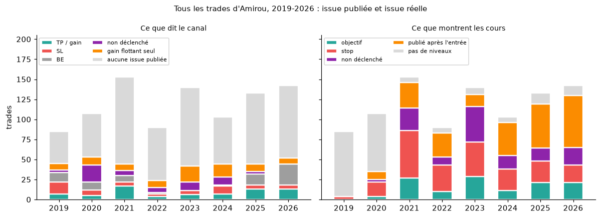

# Tous les trades, mois par mois (mars 2019 - octobre 2026)

*Rédigé le 06/10/2026. Complète [`TRADES_SEPTEMBRE.md`](TRADES_SEPTEMBRE.md), qui ne couvrait que les mois de septembre.*

**Données et script** :
- [`data/verification_trades.csv`](../data/verification_trades.csv) : une ligne par trade (953), avec le message du trade, les messages d'issue, l'issue selon le canal, l'issue selon les cours et une note quand il y a eu vérification à la main ;
- [`data/verification_mensuelle.csv`](../data/verification_mensuelle.csv) : les comptes par mois ;
- [`scripts/verifier_tous_les_trades.py`](../scripts/verifier_tous_les_trades.py).

## Méthode

1. **Les trades viennent de trois sources**, fusionnées :
   - le registre des messages texte (`data/trades.csv`, surtout 2019-2020) ;
   - les captures lues par OCR (`data/trades_simules.csv`, 2021-2026) ;
   - les captures de la revue visuelle (`data/revue_trades_simules.csv`, 2021-2026), **trades d'Amirou seulement** (pas les membres ni les tiers).
   - Un trade texte et une capture sur la même paire, dans le même sens, à moins de deux jours, sont comptés une seule fois (source « texte + capture »).
2. **Ce que dit le canal.** On cherche, dans les 10 jours qui suivent et sur la même paire, un message d'issue (`data/trade_events.csv` : TP, SL, BE, « en gain ») ou une capture de résultat (même sens, entrée à 0,15 % près si elle est visible).
   - ✅ TP annoncé, ❌ SL annoncé, ➖ BE ou sortie à zéro, ⏸ annulé ou non déclenché ;
   - ⚠️ seulement un gain « flottant » (« +80 pips en cours », capture d'une position ouverte) : **ce n'est pas un TP** ;
   - ❔ aucune issue publiée.
3. **Ce que montrent les cours.** Le plan publié (entrée, stop, objectif) est rejoué :
   - en horaire (Yahoo) depuis le 15/12/2023 ;
   - en journalier avant (Yahoo à partir de 2020, Dukascopy pour 2019-2021 : `data/prix/journalier_dukascopy_registre.csv`) ;
   - ✅ objectif atteint, ❌ stop, ⏸ jamais déclenché, ⚠️ publié après l'entrée (le prix avait déjà passé l'entrée : non copiable), ❔ niveaux absents ou pas de cours.
   - **Limite** : en journalier, si la même bougie touche le stop et l'objectif, on compte le stop. Avec les stops de 10 à 16 pips de 2021-2022, cela gonfle les stops. **Seules les années 2024-2026 (horaire) sont fiables trade par trade.**
4. **Écarts.** Chaque cas où le canal et les cours se contredisent a été relu. Sur 2024-2026, chaque écart a été repris à la main dans les messages et les captures (section 3).



## 1. Ce que dit le canal

| Année | Trades | ✅ TP | ❌ SL | ➖ BE | ⏸ non déclenché | ⚠️ flottant seulement | ❔ aucune issue |
|---|---|---|---|---|---|---|---|
| 2019 | 85 | 7 | 15 | 12 | 3 | 8 | 40 |
| 2020 | 107 | 5 | 7 | 10 | 21 | 10 | 54 |
| 2021 | 153 | 17 | 5 | 8 | 6 | 8 | 109 |
| 2022 | 90 | 4 | 3 | 2 | 6 | 9 | 66 |
| 2023 | 140 | 6 | 5 | 0 | 11 | 20 | 98 |
| 2024 | 103 | 7 | 10 | 1 | 10 | 16 | 59 |
| 2025 | 133 | 13 | 5 | 14 | 3 | 9 | 89 |
| 2026 | 142 | 13 | 5 | 26 | 0 | 8 | 90 |
| **Total** | **953** | **72** | **55** | **73** | **60** | **88** | **605** |

- **Pour 605 trades sur 953 (63 %), le canal ne publie aucune issue.** Le plan est montré, la suite ne l'est pas.
- Quand une issue est publiée, TP et SL s'équilibrent presque (72 contre 55). Les stops annoncés se font rares après 2020 (3 à 5 par an sauf 2024), les passages à BE se multiplient en 2025-2026.
- 88 trades n'ont qu'un gain « flottant » comme suite : aucune clôture n'est montrée.

## 2. Ce que montrent les cours

| Année | ✅ objectif | ❌ stop | ⏸ non déclenché | ⚠️ publié après l'entrée | ❔ inconnu | Résolution |
|---|---|---|---|---|---|---|
| 2019 | 0 | 4 | 0 | 0 | 81 | journalier, peu de niveaux |
| 2020 | 4 | 18 | 3 | 10 | 72 | journalier |
| 2021 | 27 | 59 | 28 | 32 | 7 | journalier (pessimiste) |
| 2022 | 10 | 33 | 10 | 30 | 7 | journalier (pessimiste) |
| 2023 | 29 | 43 | 44 | 15 | 9 | journalier |
| 2024 | 11 | 27 | 17 | 41 | 7 | horaire |
| 2025 | 21 | 27 | 16 | 55 | 14 | horaire |
| 2026 | 21 | 22 | 22 | 65 | 12 | horaire |
| **Total** | **123** | **233** | **140** | **248** | **209** | |

- **2019-2020** : les messages donnent rarement entrée, stop **et** objectif (« sell now », stop seul) : 153 trades sur 192 ne sont pas rejouables.
- **Les plans publiés après l'entrée augmentent** : 41 en 2024, 55 en 2025, 65 en 2026 (46 % des trades de 2026). Ils ne sont pas copiables.
- **Trades copiables et déclenchés, 2024-2026 (horaire)** : 130 trades, 40 % d'objectifs, **+0,21 R** en moyenne (2024 −0,11 ; 2025 +0,35 ; 2026 +0,32). Même chiffre que dans [`REVUE_CAPTURES.md`](REVUE_CAPTURES.md) : un léger avantage, non significatif.

## 3. Le canal et les cours se contredisent-ils ?

**Quand les deux donnent une issue nette** (toutes années) :

| | Cours ✅ | Cours ❌ |
|---|---|---|
| Canal ✅ TP | 14 | 9 |
| Canal ❌ SL | 2 | 14 |

**Sur 2024-2026 (horaire)** : canal ✅ → cours ✅ 7, ❌ 1 ; canal ❌ → cours ✅ 0, ❌ 7. Les écarts relevés d'abord par le script ont tous été repris à la main :

| Trade | Ce que le script trouvait | Ce que montrent les messages |
|---|---|---|
| AUDJPY, #10510 (24/01/2024) | SL annoncé, objectif selon les cours | le « SL » est #10529, un message d'encouragement mal classé (« imaginez, vous fermez ce soir… », « si on doit toucher SL on le prendra ») ; **aucune issue publiée**. Les cours atteignent l'objectif le 31/01/2024. #10513 précise seulement l'objectif. |
| GBPJPY, #10853 (02/04/2024) | TP annoncé, stop selon les cours | position **fermée en gain avant l'objectif** : +9 900 $ le 03/04 (#10865). Le plan publié, tenu jusqu'au bout, aurait fini au stop le 12/04. Le TP annoncé est réel ; copier le plan à la lettre aurait perdu. |
| EURUSD, #13808 (12/09/2025) | objectif non atteint | l'OCR avait lu 1.19593 ; la capture #13836 montre l'objectif **1.18722, atteint**. |
| EURNZD, #15295 (03/09/2026) | TP annoncé, stop selon les cours | **stop élargi après la publication** (1.97098 → 1.97, #15315). Le plan publié touche son stop le 04/09 avant l'objectif ; la version modifiée atteint l'objectif. |

**Aucun faux TP n'a été trouvé sur 2024-2026.** Les TP annoncés correspondent à des mouvements réels, mais deux fois sur quatre il fallait une décision prise après la publication (sortie anticipée, stop déplacé) que le lecteur ne pouvait pas connaître à l'avance.

**Gains flottants qui finissent au stop.** 18 trades n'ont pour suite qu'un gain « en cours », alors que les cours atteignent ensuite le stop du plan publié, sans que le canal le dise :
- 2024-2026 (horaire, fiable) : GBPAUD #11942 (18/09/2024), GBPJPY #12275 (15/11/2024), EURAUD #12397 (29/11/2024), USDCHF #14000 et USDJPY #14001 (01/10/2025), NZDJPY #14943 (16/06/2026), GBPAUD #15235 (20/08/2026) ;
- 2020-2023 (journalier) : USDCAD #2265, GBPJPY #3403, EURUSD #4177, EURGBP #4345, AUDUSD #4525, NZDUSD #5468, XAUUSD #5549, EURUSD #6291 et #6564, EURJPY #7285, GBPUSD #7410.
- Amirou a pu sortir ou déplacer son stop entre-temps : le canal ne le montre pas. Ce sont donc des ⚠️, pas des gains.

**TP annoncés que les cours journaliers donnent au stop** (2021-2023) : EURAUD #3537, GBPUSD #3576 et #3591, EURUSD #4189, GBPUSD #4847, EURJPY #6168, GBPUSD #6679, GBPCAD #8484. Avec des stops de 10 à 30 pips, la bougie journalière touche souvent les deux niveaux ; la règle « stop d'abord » décide alors. **Ces cas ne sont pas tranchables** sans cours horaires, absents pour cette période. À l'inverse, deux SL annoncés (AUDUSD #5093, décembre 2021) correspondent à un objectif en journalier, pour la même raison.

## 4. Ce qu'il faut retenir

1. **Tous les mois du canal ont été passés au crible** (953 trades, 88 mois), et pas seulement les septembres.
2. **Le canal ne publie une issue nette (TP, SL, BE, annulation) que pour un trade sur quatre** (260 sur 953). Les autres restent sans suite (605) ou avec un simple gain flottant (88).
3. **Les issues publiées sont exactes sur la période vérifiable** (2024-2026) : aucun faux TP, mais des TP obtenus en s'écartant du plan publié (sortie anticipée #10853, stop élargi #15295).
4. **Une part croissante des plans est publiée après l'entrée** (46 % en 2026) : ce ne sont pas des signaux copiables.
5. **Copiés à la lettre, les plans de 2024-2026 donnent +0,21 R par trade**, un avantage faible et non significatif.
6. Avant 2024, le rejeu en journalier ne permet pas de juger trade par trade ; il sert seulement à repérer les cas à relire.

## Annexe : comptes par mois

« R copiable » : somme des R des trades publiés avant l'entrée et rejoués sur les cours (journalier avant le 15/12/2023, donc approximatif ; les mois de 2021 à plus de +30 R viennent de trades à ratio 1:7-1:10, peu fiables en journalier).

| Mois | Trades | Canal ✅ | ❌ | ➖ | ⏸ | ⚠️ flottant | ❔ | Cours ✅ | ❌ | ⏸ | ⚠️ après coup | R copiable (somme) |
|---|---|---|---|---|---|---|---|---|---|---|---|---|
| 2019-03 | 9 | 0 | 0 | 3 | 0 | 0 | 6 | 0 | 3 | 0 | 0 | -3,0 |
| 2019-04 | 15 | 0 | 0 | 4 | 0 | 5 | 6 | 0 | 1 | 0 | 0 | -1,0 |
| 2019-05 | 13 | 0 | 2 | 1 | 0 | 0 | 10 | 0 | 0 | 0 | 0 | 0 |
| 2019-06 | 15 | 2 | 4 | 0 | 1 | 1 | 7 | 0 | 0 | 0 | 0 | 0 |
| 2019-07 | 1 | 0 | 0 | 0 | 0 | 1 | 0 | 0 | 0 | 0 | 0 | 0 |
| 2019-08 | 3 | 1 | 0 | 0 | 1 | 0 | 1 | 0 | 0 | 0 | 0 | 0 |
| 2019-09 | 21 | 4 | 8 | 4 | 0 | 1 | 4 | 0 | 0 | 0 | 0 | 0 |
| 2019-10 | 5 | 0 | 0 | 0 | 1 | 0 | 4 | 0 | 0 | 0 | 0 | 0 |
| 2019-11 | 3 | 0 | 1 | 0 | 0 | 0 | 2 | 0 | 0 | 0 | 0 | 0 |
| 2020-01 | 9 | 0 | 1 | 2 | 0 | 2 | 4 | 0 | 0 | 0 | 0 | 0 |
| 2020-02 | 16 | 2 | 3 | 2 | 3 | 1 | 5 | 0 | 0 | 0 | 0 | 0 |
| 2020-03 | 25 | 2 | 1 | 4 | 5 | 3 | 10 | 1 | 3 | 2 | 2 | +1,2 |
| 2020-04 | 28 | 0 | 0 | 1 | 1 | 3 | 23 | 3 | 11 | 0 | 7 | -4,9 |
| 2020-05 | 8 | 0 | 1 | 0 | 2 | 0 | 5 | 0 | 4 | 1 | 1 | -4,0 |
| 2020-06 | 2 | 0 | 0 | 1 | 0 | 0 | 1 | 0 | 0 | 0 | 0 | 0 |
| 2020-07 | 6 | 0 | 0 | 0 | 3 | 1 | 2 | 0 | 0 | 0 | 0 | 0 |
| 2020-08 | 6 | 0 | 1 | 0 | 4 | 0 | 1 | 0 | 0 | 0 | 0 | 0 |
| 2020-10 | 2 | 1 | 0 | 0 | 1 | 0 | 0 | 0 | 0 | 0 | 0 | 0 |
| 2020-11 | 2 | 0 | 0 | 0 | 1 | 0 | 1 | 0 | 0 | 0 | 0 | 0 |
| 2020-12 | 3 | 0 | 0 | 0 | 1 | 0 | 2 | 0 | 0 | 0 | 0 | 0 |
| 2021-01 | 17 | 0 | 0 | 0 | 0 | 0 | 17 | 4 | 6 | 2 | 4 | +32,7 |
| 2021-02 | 11 | 1 | 0 | 0 | 0 | 1 | 9 | 2 | 6 | 3 | 0 | +9,5 |
| 2021-03 | 22 | 3 | 0 | 0 | 4 | 1 | 14 | 2 | 6 | 5 | 8 | +5,6 |
| 2021-04 | 8 | 0 | 0 | 0 | 0 | 0 | 8 | 1 | 2 | 2 | 3 | -0,1 |
| 2021-05 | 8 | 0 | 0 | 4 | 0 | 0 | 4 | 2 | 3 | 0 | 1 | +33,2 |
| 2021-06 | 11 | 2 | 0 | 0 | 1 | 2 | 6 | 3 | 6 | 1 | 0 | +35,7 |
| 2021-07 | 12 | 1 | 0 | 1 | 0 | 1 | 9 | 0 | 7 | 2 | 2 | -7,0 |
| 2021-08 | 2 | 1 | 0 | 0 | 0 | 0 | 1 | 0 | 1 | 1 | 0 | -1,0 |
| 2021-09 | 9 | 1 | 0 | 0 | 0 | 1 | 7 | 0 | 4 | 2 | 3 | -4,0 |
| 2021-10 | 12 | 2 | 0 | 0 | 0 | 0 | 10 | 0 | 6 | 3 | 3 | -6,0 |
| 2021-11 | 21 | 5 | 2 | 0 | 1 | 0 | 13 | 8 | 6 | 3 | 4 | +67,3 |
| 2021-12 | 20 | 1 | 3 | 3 | 0 | 2 | 11 | 5 | 6 | 4 | 4 | +10,5 |
| 2022-01 | 12 | 0 | 0 | 0 | 0 | 2 | 10 | 1 | 7 | 1 | 2 | -3,4 |
| 2022-02 | 8 | 0 | 0 | 0 | 1 | 1 | 6 | 0 | 4 | 2 | 1 | -4,0 |
| 2022-03 | 3 | 0 | 0 | 0 | 0 | 0 | 3 | 0 | 2 | 1 | 0 | -2,0 |
| 2022-04 | 3 | 0 | 0 | 0 | 2 | 0 | 1 | 0 | 1 | 0 | 1 | -1,0 |
| 2022-06 | 1 | 0 | 0 | 0 | 0 | 0 | 1 | 1 | 0 | 0 | 0 | +16,0 |
| 2022-07 | 10 | 0 | 1 | 2 | 0 | 0 | 7 | 3 | 2 | 2 | 1 | +2,8 |
| 2022-08 | 12 | 3 | 0 | 0 | 0 | 1 | 8 | 3 | 6 | 0 | 2 | +5,6 |
| 2022-09 | 13 | 0 | 1 | 0 | 3 | 1 | 8 | 0 | 2 | 2 | 8 | -2,0 |
| 2022-10 | 17 | 1 | 1 | 0 | 0 | 1 | 14 | 1 | 8 | 1 | 7 | +0,4 |
| 2022-11 | 11 | 0 | 0 | 0 | 0 | 3 | 8 | 1 | 1 | 1 | 8 | +4,8 |
| 2023-01 | 10 | 1 | 1 | 0 | 0 | 3 | 5 | 1 | 3 | 5 | 1 | +1,7 |
| 2023-02 | 10 | 1 | 1 | 0 | 0 | 4 | 4 | 4 | 4 | 1 | 1 | +14,8 |
| 2023-03 | 9 | 0 | 2 | 0 | 2 | 0 | 5 | 0 | 5 | 2 | 1 | -5,0 |
| 2023-04 | 10 | 0 | 0 | 0 | 0 | 3 | 7 | 4 | 0 | 5 | 1 | +13,4 |
| 2023-05 | 12 | 1 | 0 | 0 | 0 | 1 | 10 | 2 | 4 | 4 | 2 | +6,3 |
| 2023-06 | 19 | 1 | 0 | 0 | 2 | 3 | 13 | 6 | 4 | 6 | 2 | +9,3 |
| 2023-07 | 13 | 0 | 0 | 0 | 0 | 0 | 13 | 1 | 5 | 5 | 0 | +5,8 |
| 2023-08 | 13 | 1 | 0 | 0 | 0 | 2 | 10 | 3 | 5 | 3 | 2 | -0,4 |
| 2023-09 | 12 | 0 | 0 | 0 | 5 | 1 | 6 | 4 | 2 | 4 | 0 | +10,3 |
| 2023-10 | 13 | 1 | 0 | 0 | 2 | 0 | 10 | 1 | 5 | 4 | 3 | 0 |
| 2023-11 | 13 | 0 | 1 | 0 | 0 | 2 | 10 | 2 | 4 | 4 | 1 | +1,1 |
| 2023-12 | 6 | 0 | 0 | 0 | 0 | 1 | 5 | 1 | 2 | 1 | 1 | +1,2 |
| 2024-01 | 5 | 0 | 1 | 0 | 0 | 0 | 4 | 1 | 1 | 1 | 1 | +0,9 |
| 2024-02 | 10 | 1 | 3 | 0 | 0 | 1 | 5 | 2 | 1 | 2 | 4 | +2,3 |
| 2024-03 | 4 | 2 | 1 | 0 | 0 | 0 | 1 | 0 | 1 | 0 | 3 | -1,0 |
| 2024-04 | 13 | 3 | 0 | 0 | 0 | 5 | 5 | 1 | 4 | 2 | 6 | -0,8 |
| 2024-05 | 7 | 0 | 1 | 0 | 0 | 0 | 6 | 0 | 5 | 1 | 1 | -5,0 |
| 2024-06 | 5 | 0 | 4 | 0 | 0 | 0 | 1 | 0 | 1 | 0 | 2 | -1,0 |
| 2024-07 | 2 | 0 | 0 | 0 | 0 | 0 | 2 | 0 | 2 | 0 | 0 | -2,0 |
| 2024-08 | 6 | 0 | 0 | 0 | 0 | 2 | 4 | 3 | 0 | 2 | 1 | +5,5 |
| 2024-09 | 17 | 1 | 0 | 1 | 8 | 1 | 6 | 1 | 6 | 1 | 7 | -3,0 |
| 2024-10 | 14 | 0 | 0 | 0 | 0 | 2 | 12 | 0 | 2 | 2 | 10 | -2,0 |
| 2024-11 | 14 | 0 | 0 | 0 | 2 | 3 | 9 | 1 | 2 | 5 | 5 | -1,3 |
| 2024-12 | 6 | 0 | 0 | 0 | 0 | 2 | 4 | 2 | 2 | 1 | 1 | +3,3 |
| 2025-01 | 13 | 0 | 2 | 2 | 1 | 0 | 8 | 1 | 3 | 1 | 5 | +1,0 |
| 2025-02 | 5 | 0 | 1 | 0 | 1 | 0 | 3 | 0 | 1 | 1 | 2 | -1,0 |
| 2025-03 | 9 | 0 | 0 | 0 | 0 | 0 | 9 | 0 | 2 | 1 | 6 | -2,0 |
| 2025-04 | 16 | 0 | 0 | 1 | 0 | 2 | 13 | 5 | 6 | 1 | 4 | +4,8 |
| 2025-05 | 6 | 2 | 1 | 0 | 1 | 0 | 2 | 1 | 0 | 3 | 1 | +2,1 |
| 2025-06 | 8 | 0 | 1 | 0 | 0 | 0 | 7 | 0 | 1 | 1 | 5 | -1,0 |
| 2025-07 | 7 | 1 | 0 | 0 | 0 | 0 | 6 | 2 | 2 | 0 | 3 | +2,9 |
| 2025-08 | 30 | 8 | 0 | 4 | 0 | 1 | 17 | 4 | 6 | 3 | 14 | +2,9 |
| 2025-09 | 13 | 1 | 0 | 2 | 0 | 1 | 9 | 3 | 2 | 2 | 5 | +1,0 |
| 2025-10 | 18 | 1 | 0 | 1 | 0 | 5 | 11 | 3 | 3 | 3 | 7 | +3,6 |
| 2025-11 | 5 | 0 | 0 | 2 | 0 | 0 | 3 | 1 | 0 | 0 | 3 | +2,0 |
| 2025-12 | 3 | 0 | 0 | 2 | 0 | 0 | 1 | 1 | 1 | 0 | 0 | +0,8 |
| 2026-01 | 6 | 0 | 0 | 2 | 0 | 0 | 4 | 0 | 1 | 2 | 2 | -1,0 |
| 2026-02 | 5 | 0 | 0 | 1 | 0 | 0 | 4 | 0 | 2 | 1 | 2 | -2,0 |
| 2026-03 | 24 | 3 | 4 | 3 | 0 | 0 | 14 | 6 | 5 | 2 | 9 | +6,4 |
| 2026-04 | 22 | 0 | 0 | 1 | 0 | 0 | 21 | 0 | 2 | 3 | 16 | -2,0 |
| 2026-05 | 16 | 1 | 0 | 5 | 0 | 1 | 9 | 2 | 4 | 0 | 9 | 0 |
| 2026-06 | 13 | 1 | 0 | 1 | 0 | 1 | 10 | 1 | 3 | 5 | 3 | -2,2 |
| 2026-07 | 22 | 3 | 0 | 6 | 0 | 1 | 12 | 6 | 3 | 3 | 8 | +9,2 |
| 2026-08 | 8 | 1 | 0 | 2 | 0 | 2 | 3 | 0 | 1 | 0 | 5 | -1,0 |
| 2026-09 | 22 | 3 | 0 | 4 | 0 | 3 | 12 | 5 | 1 | 4 | 10 | +4,5 |
| 2026-10 | 4 | 1 | 1 | 1 | 0 | 0 | 1 | 1 | 0 | 2 | 1 | +2,0 |

## Relancer

```
python scripts/verifier_tous_les_trades.py
python scripts/figures_rapports.py
```
