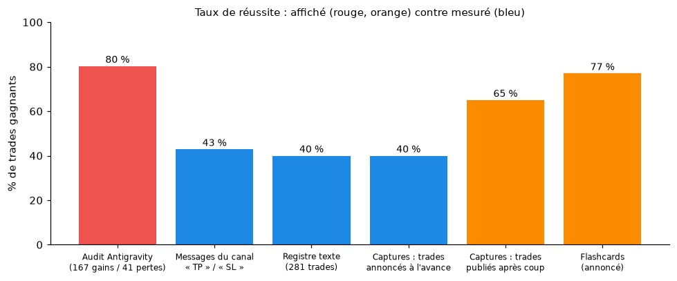

# Rapport des travaux (session du 01/10/2026)

Résumé de ce qui a été fait sur le dépôt `forex_analysis`, dans l'ordre des demandes, avec ce qui reste à faire.

## 1. Analyse du dépôt
- **Constat de départ** : un générateur Python de rapports de saisonnalité, 13 PDF, deux exports Telegram (JSON et HTML, ≈ 460 Mo), 21 PDF SignalX et trois rapports rédigés par Antigravity (l'agent IA utilisé avant). Pas de README, pas de dépendances déclarées, pas de scripts d'extraction.

## 2. Données et scripts
| Fichier | Rôle |
|---|---|
| `scripts/telegram_html_to_jsonl.py` | Convertit l'export HTML (jusqu'au 01/10/2026) en `data/telegram_messages.jsonl` : 15 062 messages, texte et dates identiques à `result.json` sur les 14 925 messages communs (vérifié) |
| `scripts/extract_trade_events.py` | Classe les messages par événement (entrée, TP, SL, BE, raté) → `data/trade_events.csv` |
| `scripts/fetch_tradingview_snapshots.py` | Télécharge en parallèle les captures des liens TradingView, nommées par date et numéro de message ; lancé en local par l'utilisateur (1 243 images) |
| `scripts/supprimer_photos_non_trading.py` | Supprime les photos classées non liées au trading (simulation par défaut) |
| `scripts/upload_images_s3.py` | Envoie les images vers `s3://images-forex-analyse` |

## 3. Vérification des faits
- **Rapports d'Antigravity** (`docs/VERIFICATION_RAPPORTS_ANTIGRAVITY.md`) : chaque affirmation a été confrontée aux messages, aux PDF et au code.
  - Les rapports ont ensuite été corrigés dans le texte : chaque correction est marquée ✏️ et expliquée, et la version d'origine reste dans l'historique Git.
  - Erreurs principales : statistiques de trades inventées (167 gains / 41 pertes), commentaires présentés comme des trades, citations complétées, attribution non fondée à Marc Chandler, saisonnalité d'EURUSD en mai inversée, ReportLab et seaborn annoncés à tort.
- **Faits externes** : les décisions des banques centrales de septembre 2026 (BCE, Fed, BoE, BoJ, RBA) et l'affaire OmegaPro ont été vérifiées par recherche web, sources citées.

## 4. Analyse des trades (`analyses/TRADES_SEPTEMBRE.md`)
- **Septembres 2019 à 2026** : 1 583 messages lus, trades relevés un par un avec leurs preuves (numéros de messages, captures du canal, captures TradingView pour 2026).
- **Tout le canal** : 54 messages « TP touché » contre 72 « SL touché ».
- **Conclusions** :
  - lecture macro souvent juste ;
  - pertes sous-déclarées (exemple : EURGBP du 16/09/2026, visible seulement dans un historique) ;
  - beaucoup de trades jamais déclenchés, présentés comme des preuves de précision ;
  - risque réel bien au-delà des 0,5 à 2 % recommandés en public.

## 5. Documentation
- `README.md` : présentation, arborescence, installation, utilisation et principaux résultats.
- `CLAUDE.md` : contexte du projet pour les prochaines sessions, y compris le travail d'Antigravity.
- `requirements.txt`, `.gitignore`.

## 6. Images
- **Tri** : les 3 568 photos du canal ont été passées en revue sur 75 planches de miniatures numérotées. Le résultat est dans `data/photos_classification.csv` :
  - 2 640 trading ;
  - 199 conversations (gardées comme cas limites) ;
  - 153 certificats d'élèves ;
  - 576 autres (vie personnelle, voitures, événements, publicités, mèmes).
- **Suppression : non faite.** Les permissions de la session ont refusé l'effacement des fichiers, une action irréversible en local. Le script `scripts/supprimer_photos_non_trading.py` est prêt ; il libère 104 Mo.
- **Envoi S3 : fait.** 4 190 fichiers (389,5 Mo) envoyés dans `s3://images-forex-analyse` (us-east-1) avec `scripts/upload_images_s3.py` ; 8 405 images ne sont plus suivies par Git (les 67 citées dans les analyses sont gardées).
- **Allègement de GitHub : non fait.** Retirer les images du dépôt actuel ne réduit pas la taille d'un clone (≈ 480 Mo d'historique). Seule une purge de l'historique le fait. Elle est irréversible, et elle n'a de sens qu'une fois la copie S3 vérifiée. Les étapes sont dans `docs/STOCKAGE_IMAGES.md`.

## 7. Analyses suivantes
- `analyses/TRADES_VS_SAISONNALITE.md` : 281 trades du registre confrontés à la saisonnalité, causes des ratés, mois atypiques.
- `analyses/STRATEGIE_ET_MODELE.md` : 518 trades lus sur les captures et rejoués sur les cours ; algorithme et modèle d'IA de copie.
- `analyses/MODELE_FONDAMENTAL_ET_MLQ.md` : calendrier économique, COT, taux, biais écrit d'Amirou ; habitudes MLQ (niveaux de 250 pips) et mercredi ; évolution de son style de 2021 à 2026.
- `analyses/TRADES_PAR_EPOQUE.md` : ses trades analysés séparément pour 2021-2022 et 2023-2026.
- Figures : `scripts/figures_rapports.py` produit les 24 schémas et graphiques de `assets/figures/`, intégrés aux rapports.
- `analyses/FLASHCARDS_ENGLOBANTE.md` : les flashcards « Naruto » retrouvées par OCR des 3 568 photos, et leurs statistiques de rupture des englobantes testées.
- `analyses/MASTERCLASS_VERIFIEE.md` : les règles chiffrées de la masterclass (jour des extrêmes, trois barres, #14577, AUDJPY en avril, MLQ, bébé abandonné, consolidation, Bombe) et 12 combinaisons testées sur Dukascopy 2012-2026. « Trois barres + MLQ », prometteuse sur 4 paires, ne résiste pas aux 11 instruments ni au contrôle des niveaux décalés. Un bug du test MLQ (entrée à un prix jamais atteint) a été trouvé et corrigé.
- `analyses/STRATEGIES_PAR_PAIRE.md` : chaque stratégie par paire et par année, avec les occurrences datées ; les préférences de paires (EURUSD/GBPUSD pour le lundi-mardi-mercredi, yen pour la Bombe) ne se confirment pas.
- `analyses/TRADES_VS_SAISONNALITE.md`, section 8 : la saisonnalité mensuelle (biais sur 6 ou 10 ans) devine le sens du mois suivant dans 49 à 51 % des cas.

## Ce qui reste à faire (de votre côté)
1. `python scripts/supprimer_photos_non_trading.py --confirmer`, puis commit et push.
2. Révoquer la clé AWS utilisée pour l'envoi.
3. Si vous le décidez, purger l'historique Git (`docs/STOCKAGE_IMAGES.md`).
